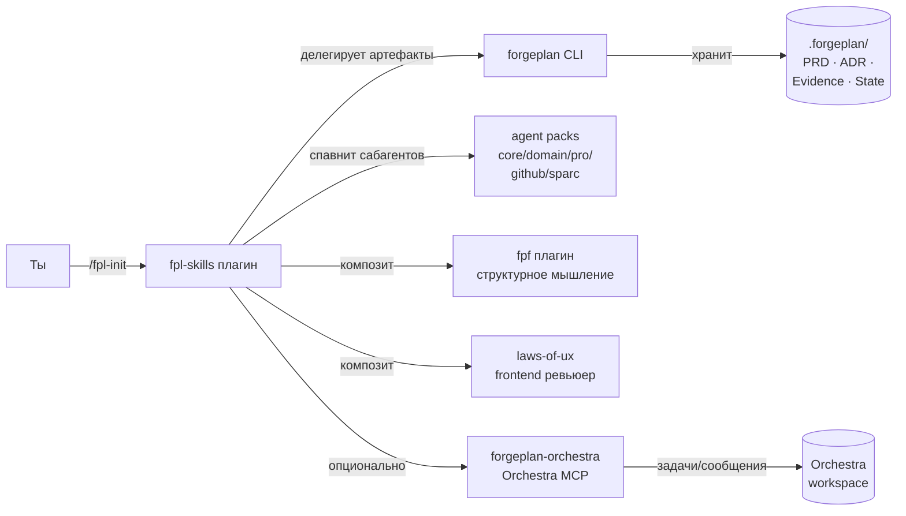

[English](DEVELOPER-JOURNEY.md) | [Русский](DEVELOPER-JOURNEY-RU.md)

# Developer Journey — от нуля до релиза

30-минутный walkthrough от «я только услышал про ForgePlan» до «я зашипил первую фичу с этим тулчейном». Выбери персону под себя и пройди шаги.

> **TL;DR**: Поставь CLI [`forgeplan`](https://github.com/ForgePlan/forgeplan) → установи `fpl-skills@ForgePlan-marketplace` → запусти `/fpl-init` в проекте → готово. Остальное — про ежедневный flow и как кусочки соединяются.

---

## Что у тебя будет в конце

- CLI `forgeplan` в `$PATH`.
- Один Claude Code плагин (`fpl-skills`), 15 slash-команд.
- Проект с `.forgeplan/`, `CLAUDE.md`, `docs/agents/`, `.mcp.json`.
- Дневной routine: утренний briefing → выбор задачи → research/refine → sprint → audit → ship.
- Опционально: agent packs (60+ специализированных сабагентов) — добавишь по мере необходимости.

---

## Как кусочки соединяются

Четыре дополняющих системы, каждая на своём уровне:

```
Orchestra    — ГДЕ задача?         (трекинг, sync, inbox)
Forgeplan    — ЧТО делать?         (PRD, evidence, lifecycle)
FPF          — КАК думать?         (decompose, evaluate, reason)
SPARC        — КАК кодить?         (spec → pseudo → arch → refine → complete)
```

Плагин `fpl-skills` — **связующий слой**: 15 slash-команд, которые композят эти системы и делегируют lifecycle артефактов в CLI `forgeplan`.



Установи `fpl-skills` + CLI `forgeplan` — это ядро. Остальные плагины добавляй по мере роста потребностей.

---

## Выбери персону

Каждая персона ниже — полный starting recipe. Выбери одну строку и пройди её Day 0 walkthrough. Другие плагины можно добавить потом.

| Персона | Стек | Под что оптимизирована |
|---|---|---|
| 🟢 [Соло-разработчик](#-соло-разработчик) | `fpl-skills` | Один владелец end-to-end; минимум церемоний. |
| 🎨 [Frontend-разработчик](#-frontend-разработчик) | `fpl-skills` + `laws-of-ux` + `agents-domain` | UI quality, framework-специалисты, UX-законы. |
| 🏛 [Архитектор / тех-лид](#-архитектор--тех-лид) | `fpl-skills` + `fpf` + `agents-sparc` + `agents-pro` | Прослеживаемые решения, сложные системы декомпозированы, SPARC quality gates. |
| 👥 [Команда с Orchestra](#-команда-с-orchestra) | `fpl-skills` + `forgeplan-orchestra` | Многосессионная координация, Inbox Pattern, sync задач. |

Дальше по гайду один и тот же worked example — **«добавить аутентификацию пользователей»** — пройдёт через все персоны, чтобы видно было как одна задача выглядит по-разному в разных ролях.

---

## Шаг 0 — Prerequisites (для всех)

Один раз на машину:

```bash
# Claude Code (если ещё нет)
brew install --cask claude-code   # macOS
# Или https://claude.com/claude-code

# CLI forgeplan
brew install ForgePlan/tap/forgeplan
# Или:
cargo install --git https://github.com/ForgePlan/forgeplan forgeplan-cli

# Проверка
forgeplan --version
```

Подключить маркетплейс (один раз):

```
/plugin marketplace add ForgePlan/marketplace
```

> [!NOTE]
> Имя маркетплейса case-sensitive: `ForgePlan-marketplace` (заглавные F и P) в командах install.

---

## 🟢 Соло-разработчик

> Один контрибьютор. Хочет полный цикл route → ship без церемоний. Командной координации не нужно.

### Day 0 — развёртка проекта

```bash
cd ~/projects/my-saas && git init -b main
claude
```

В Claude Code:

```
/plugin install fpl-skills@ForgePlan-marketplace
/reload-plugins
/fpl-init
```

`/fpl-init` показывает план, спрашивает один раз подтверждение, дальше:
1. Запускает `forgeplan init` (создаёт `.forgeplan/`).
2. Прописывает `.mcp.json` (forgeplan MCP сервер).
3. Прописывает `.claude/settings.json` (опциональный safety hook — спрашивает).
4. Рендерит `CLAUDE.md` из stack-aware шаблона (~500 строк, U-curve attention layout).
5. Запускает `/setup` wizard (интерактивно — issue tracker, build команды, paths, домен).

Итог: проект полностью wired за ~10 минут.

### Day 1 — первая фича («добавить auth»)

```
/restore                          # быстрое восстановление контекста
/research как добавить auth в Next.js с magic-link
# → research/reports/auth/REPORT.md (5 параллельных агентов: code · docs · status · references · memory)

/refine research/reports/auth/REPORT.md
# → уточнённый план; lazy-создаёт ADR-001 если всплыло ключевое решение

/sprint реализовать magic-link auth по уточнённому плану
# → wave-based execution с file ownership; гоняет тесты/lint per-wave

/audit
# → 4 параллельных ревьюера (logic, architecture, types, security)

# Когда findings чистые:
forgeplan new evidence "auth implemented; vitest 14 pass; manual smoke OK"
forgeplan link EVID-MMM PRD-NNN --relation informs
forgeplan activate PRD-NNN
gh pr create --base main
```

Это полный lifecycle — research → refine → build → audit → evidence → activate → ship.

### Day N — ежедневный routine

```
/restore       # 30 сек — ветка + dirty state + stash + recent decisions
/briefing      # обзор трекера (Orchestra/GitHub/Linear/local TODO)
# Выбираешь задачу. Для большинства задач:
/sprint <задача>
/audit
```

Для ночных unattended-прогонов: `/autorun <задача>` (без пауз на approval).

---

## 🎨 Frontend-разработчик

> UI heavy. Хочет framework-специалистов, UX-law enforcement, быстрый feedback по визуальному качеству.

### Day 0 — bootstrap

Как у Соло, плюс UI-плагины:

```
/plugin install fpl-skills@ForgePlan-marketplace
/plugin install laws-of-ux@ForgePlan-marketplace
/plugin install agents-domain@ForgePlan-marketplace
/reload-plugins
/fpl-init
```

`/fpl-init` детектит `package.json` + React/Vue/Svelte и рендерит frontend-leaning `CLAUDE.md`.

### Day 1 — «добавить login form для magic-link»

```
/research паттерны login form React 19 с magic-link
/refine research/reports/login-form/REPORT.md

/sprint реализовать <Login /> компонент + form validation + ARIA
# Спавнит typescript-pro и frontend-developer сабагентов из agents-domain
# Спавнит ux-reviewer (из laws-of-ux) при сохранении файла — auto-hints UX-законов

/audit
# Logic, architecture, types, security И ux-reviewer
# (auto-spawned потому что changeset frontend-heavy)

/ux-review
# Целевой UX-law аудит если /audit не зашёл достаточно глубоко
```

### Day N — frontend сигналы

`PostToolUse:Write` хуки от `laws-of-ux` авто-подсказывают UX-законы при правке `.html`/`.css`/`.jsx`/`.tsx`/`.vue`. Звать не нужно — они наблюдают.

---

## 🏛 Архитектор / тех-лид

> Кросс-системные решения. Нужно структурное мышление, multi-phase реализация, traceability решений.

### Day 0 — bootstrap

```
/plugin install fpl-skills@ForgePlan-marketplace
/plugin install fpf@ForgePlan-marketplace
/plugin install agents-sparc@ForgePlan-marketplace
/plugin install agents-pro@ForgePlan-marketplace
/reload-plugins
/fpl-init
```

### Day 1 — «выбрать стратегию auth»

```
/research auth подходы: magic-link vs OAuth vs passwords vs WebAuthn
# Глубокое многоагентное исследование

/fpf decompose наш auth-домен
# → таблица bounded contexts, ролей, интерфейсов

/fpf evaluate magic-link vs OAuth для B2B SaaS
# → F-G-R скоринг, ADI 3+ гипотезы
# Рекомендация с confidence + missing evidence

/rfc create auth-strategy
# → RFC с фазами, рассмотренными альтернативами

/sprint реализовать выбранную стратегию
# Детектится как Deep — вызывает SPARC orchestrator если установлен agents-sparc:
#   Wave 1: specification агент
#   Wave 2: pseudocode + architecture агенты (параллельно)
#   Wave 3: refinement агент (TDD)
# Каждая фаза gate-ит следующую.

/audit
# 4 базовых + security-expert (из agents-pro) + architect-review
```

### Day N — depth-first defaults

Для Deep задач `/sprint` автоматически проходит SPARC фазы. Quality gates между фазами предотвращают рассогласование.

---

## 👥 Команда с Orchestra

> Multi-session, multi-developer. Хочет Inbox Pattern, sync задач, статус-mapping.

### Day 0 — bootstrap

```
/plugin install fpl-skills@ForgePlan-marketplace
/plugin install forgeplan-orchestra@ForgePlan-marketplace
/reload-plugins
/fpl-init
```

После `/fpl-init` сконфигурируй Orchestra MCP сервер в `.mcp.json` (точный конфиг есть в README [`forgeplan-orchestra`](../plugins/forgeplan-orchestra/README-RU.md)).

### Day 1 — «продолжить вчерашнюю работу по auth»

```
/session
# Шаг 1: контекст восстановлен из Hindsight + CLAUDE.md
# Шаг 2: inbox collection (2 новых сообщения Orchestra, 3 коммита, 1 forgeplan blind spot)
# Шаг 3: project health
# Шаг 4: inbox triage — что сделать с каждым сигналом
# Шаг 5: synthesis — «продолжить PRD-021; потом починить blind spot RFC-003»

/sync
# Двунаправленный diff: Forgeplan артефакты ↔ Orchestra задачи
# Apply changes? [y/n]
```

### Day N — coordination signals

Orchestra `Status` ↔ Forgeplan `Phase` mapping автоматический:

| Orchestra Status | Forgeplan Phase |
|---|---|
| Backlog | Shape |
| To Do | Validate |
| Doing | Code |
| Review | Evidence |
| Done | Done |

Когда `forgeplan activate <id>` — соответствующая Orchestra-задача переезжает в Done. Когда коллега обновил Orchestra-задачу — `/sync` всплывает изменение.

---

## Когда добавлять плагины

Не ставь всё сразу. Добавляй по мере необходимости:

| Триггер | Поставить |
|---|---|
| Регулярно спавнишь одни и те же типы сабагентов | `agents-core` (debugger, code-reviewer, planner, tester, ...) |
| Stack-специфичная работа (Go, Rust, mobile, electron) | `agents-domain` |
| Production / security focus | `agents-pro` |
| GitHub-heavy workflow (много PR/issues/releases) | `agents-github` |
| Сложные Deep задачи требующие строгого фазирования | `agents-sparc` |
| Унаследовал brownfield-кодовую базу с legacy-доками | `forgeplan-brownfield-pack` |
| Нужен более узкий forgeplan-only loop чем broader bundle fpl-skills | `forgeplan-workflow` |

`/audit` и `/sprint` автоматически используют любые установленные subagent типы — установка единственный switch.

---

## Как агенты активируются

Большинство агентов вручную звать не нужно — они активируются по контексту:

| Триггер | Агент | Плагин |
|---|---|---|
| Файлы изменены без тестов | `dev-advisor` (предлагает тесты) | dev-toolkit / fpl-skills |
| `/sprint` детектит Deep + установлен agents-sparc | `sparc-orchestrator` + 4 фазных агента | agents-sparc |
| `/audit` запущен + frontend файлы в changeset + установлен laws-of-ux | `ux-reviewer` | laws-of-ux |
| Детектятся ключевые слова architecture/decision | `fpf-advisor` | fpf |
| `forgeplan new`/`activate` + установлен forgeplan-orchestra | `orchestra-advisor` (предлагает sync) | forgeplan-orchestra |
| Правка `.html`/`.css`/`.jsx`/`.tsx`/`.vue` | UX hint hook | laws-of-ux |
| Детектятся ключевые слова routing/evidence | `forge-advisor` | forgeplan-workflow |

Можешь и явно позвать конкретного агента:

> «Используй security-expert агента для review этого auth-кода»
> «Спавни typescript-pro для этого рефакторинга»
> «Запусти debugger агента на этот stack trace»

---

## Common recipes

### Старт утром

```
/session         # если установлен Orchestra
# ИЛИ
/restore         # если нет
/briefing        # обзор трекера
```

### «У меня есть идея, что делать?»

```
/research <идея>      # gap analysis, prior art, references
/refine <план>        # терминология, противоречия
/rfc create           # если стоит формального документа
forgeplan route       # решить depth; направить в /sprint или /autorun
```

### «Что-то сломалось»

```
/diagnose <описание бага>
# 6-фазный debug loop — Фаза 1 («построй feedback loop») это весь скилл
```

### «Ночной прогон»

```
/autorun <задача>
# Research → sprint → audit → report end-to-end, без пауз на approval.
# Останавливается только на red-line операциях (push в main, secret writes, deploys).
```

### «Мигрировать legacy репо»

```
/plugin install forgeplan-brownfield-pack@ForgePlan-marketplace
# Дальше по brownfield-pack README — playbooks для ингеста из
# Obsidian, MADR, ad-hoc markdown в forgeplan граф.
```

---

## Что этот гайд НЕ покрывает

- **Глубокое погружение в каждую команду** — см. README плагинов (`plugins/<name>/README.md`).
- **CLI `forgeplan` reference** — см. [forgeplan документацию](https://github.com/ForgePlan/forgeplan).
- **Детали реализации хуков** — см. секцию «Hook Behavior» в [USAGE-GUIDE-RU.md](USAGE-GUIDE-RU.md).
- **Архитектурная ментальная модель** — см. [ARCHITECTURE-RU.md](ARCHITECTURE-RU.md).
- **CLAUDE.md best practices** — см. `plugins/fpl-skills/skills/bootstrap/resources/guides/CLAUDE-MD-GUIDE.ru.md`.
- **`.forgeplan/` setup contract** — см. `plugins/fpl-skills/skills/bootstrap/resources/guides/FORGEPLAN-SETUP.md`.

---

## Следующие шаги

- **Только что поставил?** Запусти `/fpl-init` в проекте, потом `/restore`.
- **Уже используешь fpl-skills?** Попробуй `/research <тема в которой не уверен>` — самый недоиспользуемый скилл.
- **Что-то не работает?** См. [USAGE-GUIDE-RU.md Troubleshooting](USAGE-GUIDE-RU.md#troubleshooting).
- **Интересны решения?** Открой `.forgeplan/adrs/` в любом проекте использующем forgeplan.

Welcome to ForgePlan.
