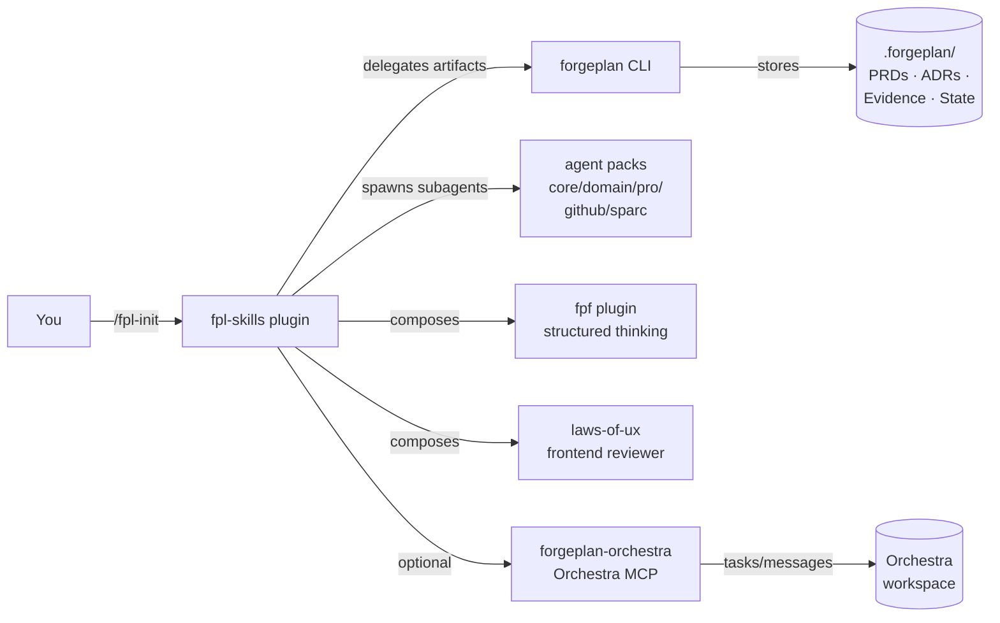

[English](DEVELOPER-JOURNEY.md) | [Русский](DEVELOPER-JOURNEY-RU.md)

# Developer Journey — From Zero to Shipping

A 30-minute walkthrough that takes you from "I just heard about ForgePlan" to "I shipped my first feature using the toolchain". Pick the persona that matches you and follow the steps.

> **TL;DR**: Install [`forgeplan`](https://github.com/ForgePlan/forgeplan) CLI → install `fpl-skills@ForgePlan-marketplace` → run `/fpl-init` in your project → done. The rest of this guide explains the daily flow and how the pieces fit.

---

## What you'll have at the end

- The `forgeplan` CLI on your `$PATH`.
- One Claude Code plugin (`fpl-skills`) installed, providing 15 slash commands.
- A target project wired with `.forgeplan/`, `CLAUDE.md`, `docs/agents/`, `.mcp.json`.
- A daily routine: morning briefing → pick task → research/refine → sprint → audit → ship.
- Optional: agent packs (60+ specialised subagents) added when you need them.

---

## How the ecosystem fits together

Four complementary systems, each operating at its own level:

```
Orchestra    — WHERE is the task?  (tracking, sync, inbox)
Forgeplan    — WHAT to do?         (PRD, evidence, lifecycle)
FPF          — HOW to think?       (decompose, evaluate, reason)
SPARC        — HOW to code?        (spec → pseudo → arch → refine → complete)
```

The `fpl-skills` plugin is the **glue layer**: 15 slash commands that compose these systems and delegate artifact lifecycle to the `forgeplan` CLI.



Install `fpl-skills` + the `forgeplan` CLI and you have the core. Add other plugins as your needs grow.

---

## Pick your persona

Each persona below is a complete starting recipe. Pick one row and follow its Day 0 walkthrough. You can always add more plugins later.

| Persona | Stack | What you optimise for |
|---|---|---|
| 🟢 [Solo developer](#-solo-developer) | `fpl-skills` | Single-person ownership end-to-end; minimum ceremony. |
| 🎨 [Frontend developer](#-frontend-developer) | `fpl-skills` + `laws-of-ux` + `agents-domain` | UI quality, framework specialists, UX laws. |
| 🏛 [Architect / tech lead](#-architect--tech-lead) | `fpl-skills` + `fpf` + `agents-sparc` + `agents-pro` | Decisions traced, complex systems decomposed, SPARC quality gates. |
| 👥 [Team with Orchestra](#-team-with-orchestra) | `fpl-skills` + `forgeplan-orchestra` | Multi-session coordination, Inbox Pattern, task sync. |

The rest of the guide threads a worked example — **"add user authentication"** — through each persona to show how the same task looks different per role.

---

## Step 0 — Prerequisites (everyone)

Install once per machine:

```bash
# Claude Code (if you don't have it)
brew install --cask claude-code   # macOS
# Or follow https://claude.com/claude-code

# forgeplan CLI
brew install ForgePlan/tap/forgeplan
# Or:
cargo install --git https://github.com/ForgePlan/forgeplan forgeplan-cli

# Verify
forgeplan --version
```

Add the marketplace (once):

```
/plugin marketplace add ForgePlan/marketplace
```

> [!NOTE]
> Marketplace name is case-sensitive: `ForgePlan-marketplace` (capital F and P) when used in install commands.

---

## 🟢 Solo developer

> Single contributor. Wants the full route → ship loop without ceremony. No team coordination needed.

### Day 0 — Bootstrap a project

```bash
cd ~/projects/my-saas && git init -b main
claude
```

Inside Claude Code:

```
/plugin install fpl-skills@ForgePlan-marketplace
/reload-plugins
/fpl-init
```

`/fpl-init` shows a plan, asks once for confirmation, then:
1. Runs `forgeplan init` (creates `.forgeplan/`).
2. Wires `.mcp.json` (forgeplan MCP server).
3. Wires `.claude/settings.json` (optional safety hook — asks).
4. Renders `CLAUDE.md` from a stack-aware template (~500 lines, U-curve attention layout).
5. Runs `/setup` wizard (interactive — issue tracker, build commands, paths, domain).

End state: project fully wired in ~10 minutes.

### Day 1 — First feature ("add user authentication")

```
/restore                          # quick context recall
/research how to add auth in Next.js with magic-link
# → research/reports/auth/REPORT.md (5 parallel agents: code · docs · status · references · memory)

/refine research/reports/auth/REPORT.md
# → sharpened plan; lazy-creates ADR-001 if a key decision surfaced

/sprint implement magic-link auth from refined plan
# → wave-based execution with file ownership; runs tests/lint per wave

/audit
# → 4 parallel reviewers (logic, architecture, types, security)

# Once findings are clean:
forgeplan new evidence "auth implemented; vitest 14 pass; manual smoke OK"
forgeplan link EVID-MMM PRD-NNN --relation informs
forgeplan activate PRD-NNN
gh pr create --base main
```

That's a full lifecycle — research → refine → build → audit → evidence → activate → ship.

### Day N — daily routine

```
/restore       # 30 sec — branch + dirty state + stash + recent decisions
/briefing      # tracker overview (Orchestra/GitHub/Linear/local TODO)
# Pick a task. For most tasks:
/sprint <task>
/audit
```

For overnight unattended runs: `/autorun <task>` (no approval pauses).

---

## 🎨 Frontend developer

> UI heavy. Wants framework specialists, UX-law enforcement, fast feedback on visual quality.

### Day 0 — Bootstrap

Same as Solo, then add UI plugins:

```
/plugin install fpl-skills@ForgePlan-marketplace
/plugin install laws-of-ux@ForgePlan-marketplace
/plugin install agents-domain@ForgePlan-marketplace
/reload-plugins
/fpl-init
```

`/fpl-init` detects `package.json` + React/Vue/Svelte and renders a frontend-leaning `CLAUDE.md`.

### Day 1 — "Add login form for magic-link auth"

```
/research login form patterns React 19 with magic-link
/refine research/reports/login-form/REPORT.md

/sprint implement <Login /> component + form validation + ARIA
# Spawns typescript-pro and frontend-developer subagents from agents-domain
# Spawns ux-reviewer (from laws-of-ux) on file save — auto-hints UX laws

/audit
# Logic, architecture, types, security AS WELL AS ux-reviewer
# (auto-spawned because changeset is frontend-heavy)

/ux-review
# Targeted UX-law audit if /audit didn't go deep enough
```

### Day N — frontend signals

`PostToolUse:Write` hooks from `laws-of-ux` auto-hint UX laws when you edit `.html`/`.css`/`.jsx`/`.tsx`/`.vue`. No need to invoke them — they observe.

---

## 🏛 Architect / tech lead

> Cross-system decisions. Needs structured reasoning, multi-phase implementation, decision traceability.

### Day 0 — Bootstrap

```
/plugin install fpl-skills@ForgePlan-marketplace
/plugin install fpf@ForgePlan-marketplace
/plugin install agents-sparc@ForgePlan-marketplace
/plugin install agents-pro@ForgePlan-marketplace
/reload-plugins
/fpl-init
```

### Day 1 — "Choose auth strategy"

```
/research auth approaches: magic-link vs OAuth vs passwords vs WebAuthn
# Deep multi-agent research

/fpf decompose our auth domain
# → bounded contexts, roles, interfaces table

/fpf evaluate magic-link vs OAuth for B2B SaaS
# → F-G-R scoring, ADI 3+ hypotheses
# Recommendation logged with confidence + missing evidence

/rfc create auth-strategy
# → RFC with phases, alternatives considered

/sprint implement chosen strategy
# Detected as Deep — invokes SPARC orchestrator if agents-sparc installed:
#   Wave 1: specification agent
#   Wave 2: pseudocode + architecture agents (parallel)
#   Wave 3: refinement agent (TDD)
# Each phase gates the next.

/audit
# 4 base + security-expert (from agents-pro) + architect-review
```

### Day N — depth-first defaults

For Deep tasks, `/sprint` automatically goes through SPARC phases. Quality gates between phases prevent inconsistencies.

---

## 👥 Team with Orchestra

> Multi-session, multi-developer. Wants Inbox Pattern, task sync, status mapping.

### Day 0 — Bootstrap

```
/plugin install fpl-skills@ForgePlan-marketplace
/plugin install forgeplan-orchestra@ForgePlan-marketplace
/reload-plugins
/fpl-init
```

After `/fpl-init`, configure the Orchestra MCP server in `.mcp.json` (the [`forgeplan-orchestra`](../plugins/forgeplan-orchestra/README.md) README has the exact config).

### Day 1 — "Pick up auth work from yesterday"

```
/session
# Step 1: context restored from Hindsight + CLAUDE.md
# Step 2: inbox collection (2 new Orchestra messages, 3 commits, 1 forgeplan blind spot)
# Step 3: project health
# Step 4: inbox triage — what to do with each signal
# Step 5: synthesis — "Continue PRD-021; then fix RFC-003 blind spot"

/sync
# Bidirectional diff: Forgeplan artifacts ↔ Orchestra tasks
# Apply changes? [y/n]
```

### Day N — coordination signals

Orchestra `Status` ↔ Forgeplan `Phase` mapping is automatic:

| Orchestra Status | Forgeplan Phase |
|---|---|
| Backlog | Shape |
| To Do | Validate |
| Doing | Code |
| Review | Evidence |
| Done | Done |

When you `forgeplan activate <id>`, the matching Orchestra task moves to Done. When a teammate updates an Orchestra task, `/sync` surfaces the change.

---

## `/forge-cycle` — first time

The 4 personas above use `fpl-skills` skills as **executors** and orchestrate `forgeplan` lifecycle calls manually (or rely on `/autorun` to do the orchestration). For users who want **a single command that runs the full methodology**, install [`forgeplan-workflow`](../plugins/forgeplan-workflow/README.md):

```
/plugin install forgeplan-workflow@ForgePlan-marketplace
/reload-plugins
```

Then for any non-trivial task:

```
/forge-cycle "Add PDF export for artifacts"
```

This walks 8 steps end-to-end:

```
Step 1: Health check    → `forgeplan health` — surfaces blind spots before starting
Step 2: Task            → confirms task description with you
Step 3: Route           → `forgeplan route` decides depth (Tactical/Standard/Deep/Critical)
Step 4: Shape           → creates PRD (and RFC/ADR if Deep), validates MUST sections
Step 5: Build           → delegates to fpl-skills' /sprint or /do for implementation
Step 6: Audit           → spawns reviewers, captures findings
Step 7: Evidence        → `forgeplan new evidence` + link to PRD + score (R_eff)
Step 8: Activate        → `forgeplan activate` once R_eff > 0
                        → prepares the conventional commit with `Refs: PRD-NNN`
```

### When to use `/forge-cycle` vs `/sprint` vs `/autorun`

| Command | Plugin | Best for |
|---|---|---|
| `/forge-cycle` | forgeplan-workflow | "Run the methodology end-to-end on this one task" — single entry point, full lifecycle. |
| `/sprint` | fpl-skills | Wave-based execution with file ownership and per-wave teammates. Use when you've already routed/shaped manually. |
| `/autorun` | fpl-skills | Overnight / unattended. Auto-delegates to `/forge-cycle` if `forgeplan-workflow` is installed; otherwise runs standalone. |
| `/do` | fpl-skills | Interactive variant of `/autorun` — pauses at phase boundaries for review. |

### Setup checklist for `/forge-cycle`

- [ ] `forgeplan` CLI on `$PATH` (same as `/fpl-init` requirement)
- [ ] `.forgeplan/` initialised (run `/fpl-init` first if not)
- [ ] `forgeplan-workflow` plugin installed
- [ ] Project has at least a draft `CLAUDE.md` so the skill knows the codebase

After the first `/forge-cycle` run you'll have a real PRD + Evidence in `.forgeplan/`. Open the same project in [`@forgeplan/web`](FORGEPLAN-WEB.md) to see the artifact graph.

---

## When to add more plugins

Don't install everything upfront. Add as you hit the need:

| Trigger | Add |
|---|---|
| You start spawning the same subagent types repeatedly | `agents-core` (debugger, code-reviewer, planner, tester, ...) |
| Stack-specific work (Go, Rust, mobile, electron) | `agents-domain` |
| Production / security focus | `agents-pro` |
| GitHub-heavy workflow (lots of PRs/issues/releases) | `agents-github` |
| Complex Deep tasks needing rigorous phasing | `agents-sparc` |
| Inheriting a brownfield codebase with legacy docs | `forgeplan-brownfield-pack` |
| Tighter forgeplan-only loop than fpl-skills' broader bundle | `forgeplan-workflow` |

`/audit` and `/sprint` automatically use whichever subagent types are available — installation is the only switch.

---

## How agents activate

You don't manually invoke most agents. They activate based on context:

| Trigger | Agent | Plugin |
|---|---|---|
| Files changed without tests | `dev-advisor` (suggests tests) | dev-toolkit / fpl-skills |
| `/sprint` detects Deep task + agents-sparc installed | `sparc-orchestrator` + 4 phase agents | agents-sparc |
| `/audit` runs + frontend files in changeset + laws-of-ux installed | `ux-reviewer` | laws-of-ux |
| Architecture/decision keywords detected | `fpf-advisor` | fpf |
| `forgeplan new`/`activate` runs + forgeplan-orchestra installed | `orchestra-advisor` (suggests sync) | forgeplan-orchestra |
| Editing `.html`/`.css`/`.jsx`/`.tsx`/`.vue` | UX hint hook | laws-of-ux |
| Routing/evidence keywords detected | `forge-advisor` | forgeplan-workflow |

You can also invoke a specific agent:

> "Use the security-expert agent to review this auth code"
> "Spawn typescript-pro for this refactoring"
> "Run the debugger agent on this stack trace"

---

## Common recipes

### Morning start

```
/session         # if Orchestra installed
# OR
/restore         # if not
/briefing        # tracker overview
```

### "I have an idea, what do I do?"

```
/research <idea>      # gap analysis, prior art, references
/refine <plan>        # sharpen terminology, surface contradictions
/rfc create           # if it warrants formal record
forgeplan route       # decide depth; route to /sprint or /autorun
```

### "Something broke"

```
/diagnose <bug description>
# 6-phase debug loop — Phase 1 ("build a feedback loop") is the entire skill
```

### "Overnight run"

```
/autorun <task>
# Research → sprint → audit → report end-to-end, no approval pauses.
# Stops only on red-line operations (push to main, secret writes, deploys).
```

### "Migrate a legacy repo"

```
/plugin install forgeplan-brownfield-pack@ForgePlan-marketplace
# Then follow the brownfield-pack README — playbooks for ingest from
# Obsidian, MADR, ad-hoc markdown into a forgeplan graph.
```

---

## What this guide doesn't cover

- **Deep dive into each command** — see the per-plugin READMEs (`plugins/<name>/README.md`).
- **`forgeplan` CLI reference** — see [forgeplan documentation](https://github.com/ForgePlan/forgeplan).
- **Hook implementation details** — see [USAGE-GUIDE.md](USAGE-GUIDE.md) "Hook Behavior" section.
- **Architecture mental model** — see [ARCHITECTURE.md](ARCHITECTURE.md).
- **Migrating from `dev-toolkit`** — see [MIGRATION-DEV-TOOLKIT-TO-FPL-SKILLS.md](MIGRATION-DEV-TOOLKIT-TO-FPL-SKILLS.md).
- **Tracker integration recipes** (Orchestra / GitHub / Linear / Jira) — see [TRACKER-INTEGRATION.md](TRACKER-INTEGRATION.md).
- **Visual artifact graph + time-travel** — see [FORGEPLAN-WEB.md](FORGEPLAN-WEB.md) for the `@forgeplan/web` browser viewer.
- **CLAUDE.md best practices** — see `plugins/fpl-skills/skills/bootstrap/resources/guides/CLAUDE-MD-GUIDE.ru.md`.
- **`.forgeplan/` setup contract** — see `plugins/fpl-skills/skills/bootstrap/resources/guides/FORGEPLAN-SETUP.md`.

---

## Next steps

- **Just installed?** Run `/fpl-init` in your project, then `/restore`.
- **Already using fpl-skills?** Try `/research <a topic you're unsure about>` — it's the most under-used skill.
- **Hitting friction?** See [USAGE-GUIDE.md Troubleshooting](USAGE-GUIDE.md#troubleshooting).
- **Curious about decisions?** Open `.forgeplan/adrs/` in any project that uses forgeplan.

Welcome to ForgePlan.
