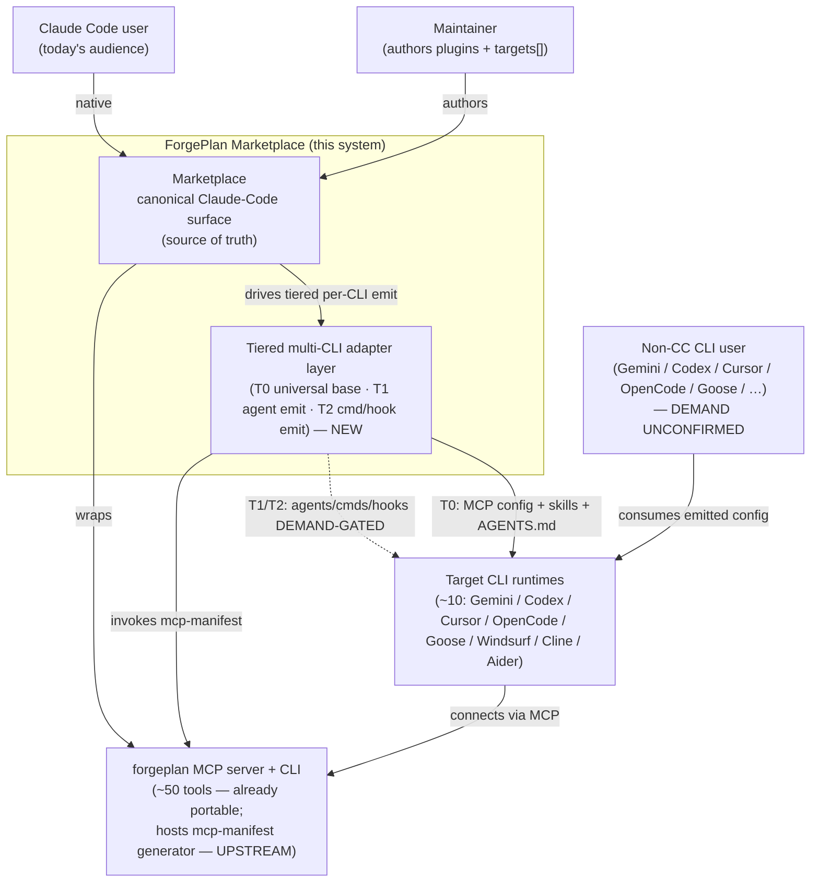
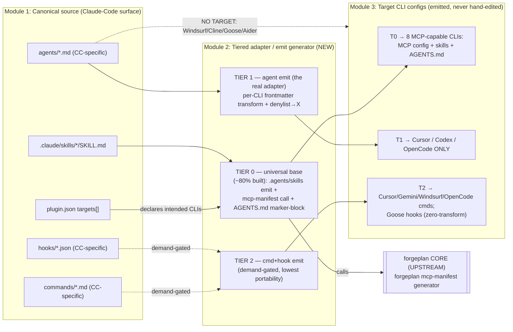

# C4 — ADR-014: Multi-CLI adapter layer (tiered)

> Co-located C4 projection extracted from ADR-014 (PRD-060 Rule 4 / PRE-3).
> ADR-014 is the source of truth; this file is the standalone C4 view the
> Guardian gate expects when inter-module flow is discussed.

The decision spans three modules — the marketplace canonical source, the
tiered emit generator, and each target CLI runtime — plus an upstream
boundary (the `forgeplan mcp-manifest` generator lives in forgeplan CORE,
not this repo). The two diagrams below frame the Decision and Scope.

## C4 L1 — System Context

Who/what the adapter layer sits between.

## C4 L2 — Container

The modules inside the boundary + the tiered emit pipeline.

## Module boundaries (narrative)

- **Module 1 — Canonical source**: the 18 plugins' Claude-Code surface
  (skills / agents / commands / hooks + `targets[]`). Single source of truth
  (INV-1); never branched to suit a target CLI.
- **Module 2 — Tiered emit generator (NEW)**: Tier 0 (universal base, ~80%
  already built) → Tier 1 (agent emit, 3 CLIs) → Tier 2 (commands / hooks,
  demand-gated). Adopts ECC's 5-layer pattern (manifest / profiles /
  adapter-factory / surgical-merge / install-state).
- **Module 3 — Emitted target configs**: generated per-CLI config, never
  hand-edited (INV-2). Tier 0 → 8 MCP-capable CLIs; Tier 1 →
  Cursor / Codex / OpenCode; Tier 2 → per-CLI commands + Goose hooks.
- **Upstream boundary**: `forgeplan mcp-manifest` lives in forgeplan CORE,
  not this marketplace repo (DD-3) — Tier 0 consumes it or documents per-CLI
  `forgeplan mcp install` until it ships.

The L2 view makes the tier split explicit: Tier 0 is portable to all 8
MCP-capable CLIs and is ~80% already built; Tier 1 (agent emit) reaches
exactly 3 CLIs via a per-CLI denylist→X transform; Tier 2 (commands + hooks)
is the lowest-portability, demand-gated tail. Windsurf / Cline / Goose / Aider
have no subagent-file model and receive no agents — a documented gap, not a bug.

## Reference

- **ADR-014** — source of these diagrams (the tiered multi-CLI decision).
- **PRD-060 Rule 4** — co-located C4 requirement for ≥3-module decisions.
- **NOTE-030** — the surface×CLI matrix and tiered (T0/T1/T2) design.
