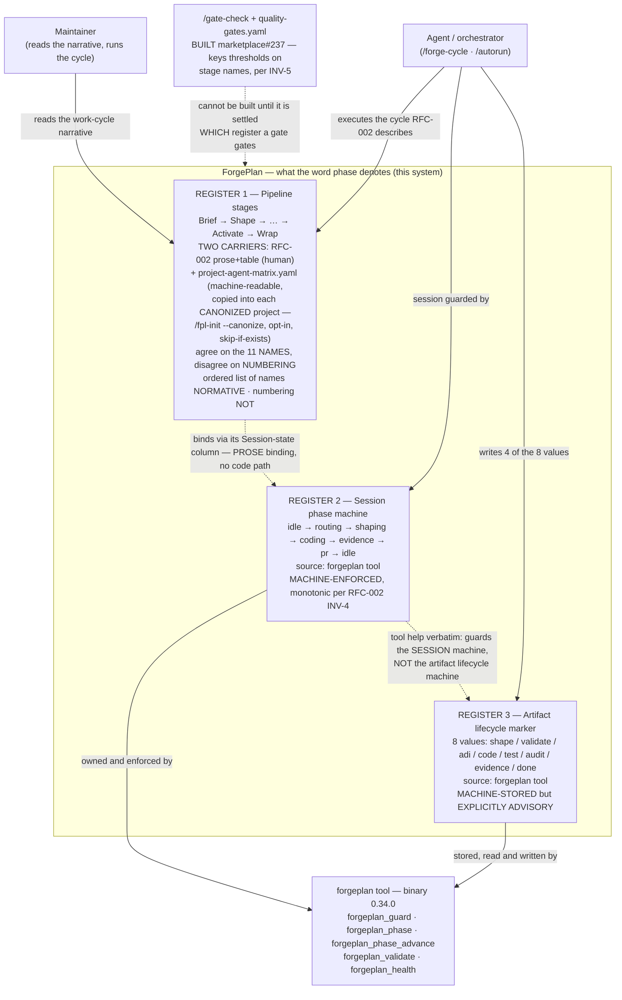
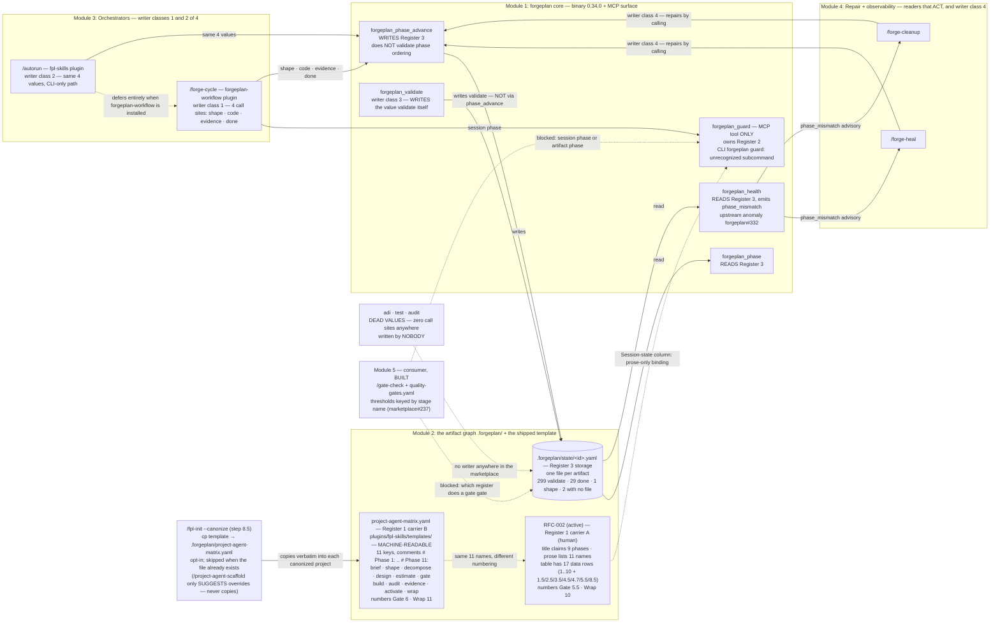

# C4 — ADR-022: The three registers of the word "phase"

> Co-located C4 projection extracted from ADR-022 (PRD-060 Rule 4).
> ADR-022 is the source of truth; this file is the standalone C4 view the
> Guardian gate expects when inter-module flow is discussed.

The decision spans five modules — forgeplan core (binary + MCP surface), the
`.forgeplan/` artifact graph, the two orchestrators that write the artifact
phase marker, the repair/observability skills that read it and write it back,
and a blocked downstream consumer that does not exist yet. The two diagrams below frame the
Decision and Scope: one word, "phase", denotes three separate registers, and
each gets its own normative source.

## C4 L1 — System Context

Who reads and who enforces each of the three registers.

## C4 L2 — Container

The five modules and the real read/write asymmetry on Register 3.

## Module boundaries (narrative)

- **Module 1 — forgeplan core (binary 0.34.0 + MCP surface)**: owns Registers 2
  and 3. `forgeplan_guard` is an MCP tool only — `forgeplan guard` on the CLI
  errors with "unrecognized subcommand". `forgeplan_phase` reads the artifact
  marker, `forgeplan_phase_advance` writes it, `forgeplan_validate` writes the
  `validate` value on its own, and `forgeplan_health` reads the marker and emits
  `phase_mismatch`.
- **Module 2 — the artifact graph `.forgeplan/` plus the shipped template**:
  holds both Register 1 carriers and the Register 3 storage. Register 1 has
  **two** carriers, not one. Carrier A is RFC-002 (active) — prose plus a table,
  its `title:` claiming 9 phases while the body names 11 stages and the table
  carries 17 data rows; its "Session state" column already binds Register 1 to
  Register 2, but only in prose. Carrier B is
  `plugins/fpl-skills/templates/project-agent-matrix.yaml`, which declares the
  same 11 stage names as YAML keys under `phase_dispatch` with `# Phase 1:` ..
  `# Phase 11:` comments — machine-readable, and copied verbatim into
  `.forgeplan/project-agent-matrix.yaml` of each project canonized by
  `/fpl-init --canonize` (step 8.5; opt-in, and skipped when the file already
  exists). That copy reaches only the projects that opted in and had no prior
  file, and on the reading this ADR adopts it is also permanent: `/fpl-init`
  never overwrites an existing copy, so an error in the template freezes into
  every already-canonized project and a re-run cannot repair it — only deleting
  the file first can. Persistence, not reach, is the argument for fixing the
  template first.
  **This rests on an unresolved contradiction in the source** (DD-7, Open
  questions): `fpl-init/SKILL.md:696` says the step still skips an existing
  file, while `:417` says `--canonize` applies forced. The ADR adopts `:696`.
  If `:417` turns out to be normative, a re-run *would* repair the copy and the
  permanence argument weakens to an ordinary staleness one — the priority would
  survive, its justification would not. The copy
  lands in the target project's own tree and is read once per cycle by
  `/forge-cycle` Step 0.5. (`/project-agent-scaffold` only
  *suggests* an `overrides:` entry for an existing matrix; it never copies the
  template.) The two carriers agree on the 11 **names** and
  disagree on the **numbering**: RFC-002 gives Gate the half-number 5.5 and
  numbers Wrap as 10, while `project-agent-matrix.yaml` numbers Gate as Phase 6
  and Wrap as Phase 11. ADR-022 resolves this by declaring the ordered list of
  11 names normative and the numbering non-normative. Register 3 lives one file
  per artifact at `.forgeplan/state/<id>.yaml`.
- **Module 3 — Orchestrators**: Register 3 has **four classes of writer**, of
  which the orchestrators are the first two. (1) `/forge-cycle`
  (forgeplan-workflow) — 4 `forgeplan_phase_advance` call sites emitting
  `shape`, `code`, `evidence`, `done`. (2) `/autorun` (fpl-skills) — the same 4
  values, but only on its CLI-only path (MCP call at `autorun/SKILL.md:451`,
  shell fallback `forgeplan phase-advance --to code` at `:461`); it advances
  nothing when forgeplan-workflow is installed and `/forge-cycle` drives the
  artifact. (3) `forgeplan_validate` — writes the `validate` value itself, NOT
  via `phase_advance`. (4) The repair skills — `/forge-heal` (SKILL.md:43, :92,
  :131) and `/forge-cleanup` (SKILL.md:141, :154, :260) — both call
  `forgeplan_phase_advance` as the AUTO-tier resolution of `phase_mismatch`.
  Writer class 4 is precisely the one ADR-022's INV-3 constrains: it
  auto-advances the marker to clear a health advisory, which is the bulk-backfill
  behaviour the ADR forbids.
- **Module 4 — Repair / observability**: `forgeplan_health` produces the
  `phase_mismatch` advisory that `/forge-heal` and `/forge-cleanup` consume.
  These are the only readers that act on Register 3 — and acting means writing
  it back, which is writer class 4 above. Filed upstream as forgeplan#332.
- **Module 5 — Downstream consumer, now built**: `/gate-check` and
  `quality-gates.yaml` shipped in marketplace#237, after this ADR settled which
  register a gate may gate. They key on **stage names** and read `status`,
  evidence and R_eff — never the artifact lifecycle marker, per INV-2. That was
  the blocker, and the answer is the reason the gate could be built at all.

The L2 view makes the asymmetry explicit. Register 3 has 8 values but only 4 are
ever emitted through `phase_advance` (`shape`, `code`, `evidence`, `done` — from
`/forge-cycle`, from `/autorun` on its CLI-only path, and from the repair skills
`/forge-heal` and `/forge-cleanup`); `validate` is written by
`forgeplan_validate` itself rather than by `phase_advance`; and `adi`, `test`,
`audit` have zero call sites anywhere in
the marketplace — they are dead values with no writer. The on-disk distribution
confirms it: 299 of 331 active artifacts sit at `validate`, 29 at `done`, 1 at
`shape`, and 2 have no state file at all. The decisive separation between
Registers 2 and 3 is the tool's own `forgeplan_guard` help text, which states
verbatim that it guards the methodology session phase machine, NOT the artifact
lifecycle phase machine (`shape/validate/adi/code/test/audit/evidence/done`).

## Reference

- **ADR-022** — source of these diagrams (the three-register separation).
- **PRD-060 Rule 4** — co-located C4 requirement for ≥3-module decisions.
- **RFC-002** (active) — Register 1 carrier A (human, prose + table); its phase
  table binds Register 1 to Register 2 via the "Session state" column; INV-4
  declares Register 2 monotonic.
- **`plugins/fpl-skills/templates/project-agent-matrix.yaml`** — Register 1
  carrier B (machine-readable); 11 `phase_dispatch` keys under `# Phase 1:` ..
  `# Phase 11:`, copied into a project's `.forgeplan/` by `/fpl-init --canonize`
  (step 8.5 — opt-in, skipped when the file already exists, and never
  overwritten on a re-run) and read once per cycle by `/forge-cycle` Step 0.5.
- **marketplace#237** — the `/gate-check` + `quality-gates.yaml` consumer, built on this decision.
- **forgeplan#332** — upstream anomaly for the `phase_mismatch` advisory loop.
