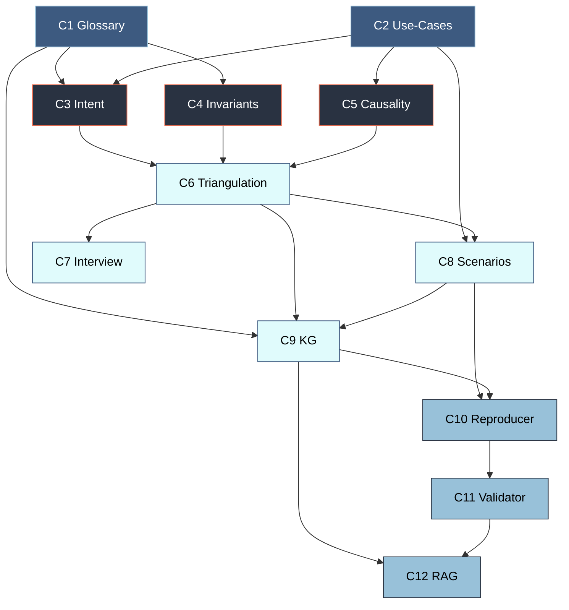
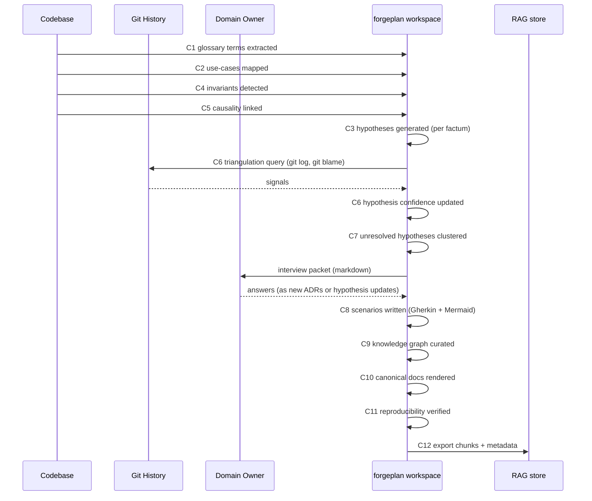

# Architecture: 12 Bounded Contexts

> Each context is a discrete responsibility with inputs, outputs, and a dedicated skill. Contexts have a dependency order (some must run before others).

## The 12 contexts at a glance

| # | Context | Input | Output | Skill file |
|---|---|---|---|---|
| C1 | **Ubiquitous Language** | Codebase | `glossary` artifacts | `skills/01-ubiquitous-language.md` |
| C2 | **Use-Case Mining** | Entry points (GraphQL, REST, queues) | `use-case` artifacts | `skills/02-use-case-miner.md` |
| C3 | **Intent Inference** | Code patterns + C1 glossary | `hypothesis` artifacts | `skills/03-intent-inferrer.md` |
| C4 | **Invariant Detection** | `if/throw/assert` guards | `invariant` artifacts | `skills/04-invariant-detector.md` |
| C5 | **Causal Linking** | Actions + events + side-effects | Causality edges in graph | `skills/05-causal-linker.md` |
| C6 | **Hypothesis Triangulation** | `hypothesis` + git + docs + interviews | Updated hypothesis confidence | `skills/06-hypothesis-triangulator.md` |
| C7 | **Interview Packaging** | Unresolved hypotheses | Interview packets (markdown) | `skills/07-interview-packager.md` |
| C8 | **Scenario Writing** | Verified use-cases + invariants | `scenario` artifacts (Gherkin) | `skills/08-scenario-writer.md` |
| C9 | **Knowledge Graph Curation** | All artifacts | Semantic graph + contradiction reports | `skills/09-kg-curator.md` |
| C10 | **Canonical Reproducer** | All verified artifacts | Standalone docs (DDL/SDL/pseudo-code) | `skills/10-canonical-reproducer.md` |
| C11 | **Reproducibility Validator** | Standalone docs + original code | Validation report | `skills/11-reproducibility-validator.md` |
| C12 | **RAG Packager** | All verified artifacts | RAG-ready chunks + metadata | `skills/12-rag-packager.md` |

## Dependency order (what must run before what)



## Phases (grouped contexts)

### Phase 1 — Foundation (C1 + C2)
**Goal**: establish a vocabulary and identify user journeys.
- Must run first because everything else depends on knowing what terms mean and what flows exist.
- Parallel-safe.

### Phase 2 — Factum Extraction (C4 + C5)
**Goal**: catalog business rules and causal chains purely from code.
- Depends on Phase 1 (needs glossary).
- Parallel-safe.

### Phase 3 — Intent Generation (C3)
**Goal**: for each factum, generate hypotheses about why.
- Depends on Phase 1 + 2.
- Produces high volume of `hypothesis` artifacts in `drafted` state.

### Phase 4 — Synthesis (C6 + C7 + C8 + C9)
**Goal**: validate hypotheses, write scenarios, curate the graph.
- C6 (triangulation) must precede C8 (scenarios) — scenarios need verified intent.
- C7 (interview) can run in parallel with C8 / C9 on independent subsets.
- C9 (KG) benefits from having all other data complete but can run incrementally.

### Phase 5 — Output (C10 + C11 + C12)
**Goal**: produce the final deliverables.
- C10 (reproducer) writes standalone docs.
- C11 (validator) verifies reproducibility.
- C12 (RAG) packages for knowledge base ingestion.
- C11 MUST run before C12 (no packaging unverified docs).

## Data flow (what passes between contexts)



## Interfaces between contexts

Each context emits artifacts of specific kinds. Downstream contexts read them. Precise contracts:

### C1 → C3, C4, C9
Output: `glossary` artifacts with frontmatter `{term, aliases, definition, confidence, tier}`.

### C2 → C3, C5, C8
Output: `use-case` artifacts with `{actor, trigger, entry_point, steps[], outcome, invariants_ref[], confidence}`.

### C3 → C6
Output: `hypothesis` artifacts with `{subject, observation, hypothesis, alternatives[], predicted_evidence[], confidence: drafted}`.

### C4 → C6, C8, C9
Output: `invariant` artifacts with `{statement, scope, violation_consequence, code_refs[], confidence}`.

### C5 → C8, C9
Output: graph edges `{source_artifact_id, target_artifact_id, relation_type}` where relation types include `causes, prevents, requires, emits, listens_to, mutates`.

### C6 → C8, C9, C7
Output: `hypothesis` artifacts updated to `inferred | strong-inferred | verified | parked | refuted`.

### C7 → Domain Owner
Output: markdown interview packet with clustered questions, context, and response template.

### C8 → C9, C10
Output: `scenario` artifacts with `{feature, background, scenarios[], visualizations[], verification: tests_or_manual}`.

### C9 → C10, C12
Output: curated graph + contradiction report.

### C10 → C11
Output: canonical markdown (per domain).

### C11 → C12
Output: validation pass/fail + discrepancy report.

### C12 → External RAG
Output: JSON bundle with `{chunks[], metadata, embeddings_hint, cross_refs[]}`.

## Iteration model (like autoresearch loop)

Each skill runs as an iteration loop, not a one-shot:

```
while not done:
    1. pick next target (artifact / file / entity)
    2. extract / generate / synthesize
    3. verify (skill-specific checks)
    4. update forgeplan workspace
    5. log progress with metric
    6. if metric stagnates 3 iterations → switch target or escalate
```

This pattern is inherited from autoresearch — skills reuse it.

## Parallelization opportunities

Within a skill, per-file/per-entity is often parallel-safe. Across skills:
- C1 and C2 run fully in parallel.
- C4 and C5 run in parallel after C1.
- C3 can run per-domain independently.
- C6 per-hypothesis is independent.
- C8 per-use-case is independent.

Sub-agents should be spawned for parallel work; main agent orchestrates.

## Failure modes and mitigations

| Failure | Mitigation |
|---|---|
| C1 produces glossary with ambiguous terms (e.g., "status" collides across Order/Trip/Invoice) | Use compound keys `{domain}.{term}` and flag collisions for Domain Owner |
| C3 generates repetitive hypotheses | Require 3 diverse alternatives; penalize near-duplicates |
| C6 triangulation gets contradictory signals | Record both; escalate to C7 as high-priority interview item |
| C7 generates too many questions | Cluster by domain, prioritize by number of artifacts blocked |
| C8 scenarios drift from code reality | C11 validator checks every scenario against current code |
| C9 graph gets too large | Tier-based collapse (show high-level first, drill down) |
| C10 misses something | C11 catches; loop back to Pass 2 |
| C11 finds discrepancies | Route to C3 re-inference or C7 interview |

## State tracking

Each context maintains state in the forgeplan workspace:

- **Progress**: iteration counter, coverage metric per domain.
- **Blocking**: open questions, failed validations.
- **History**: what was tried, what was kept/discarded.

Inspired by autoresearch's `learn-results.tsv` pattern.

## Next documents

- `04-FORGEPLAN-EXTENSIONS.md` — the forgeplan changes needed.
- `05-AUTORESEARCH-INTEGRATION.md` — how to wire with autoresearch.
- `06-SKILLS-INVENTORY.md` — quick-reference of all 12 skills.
