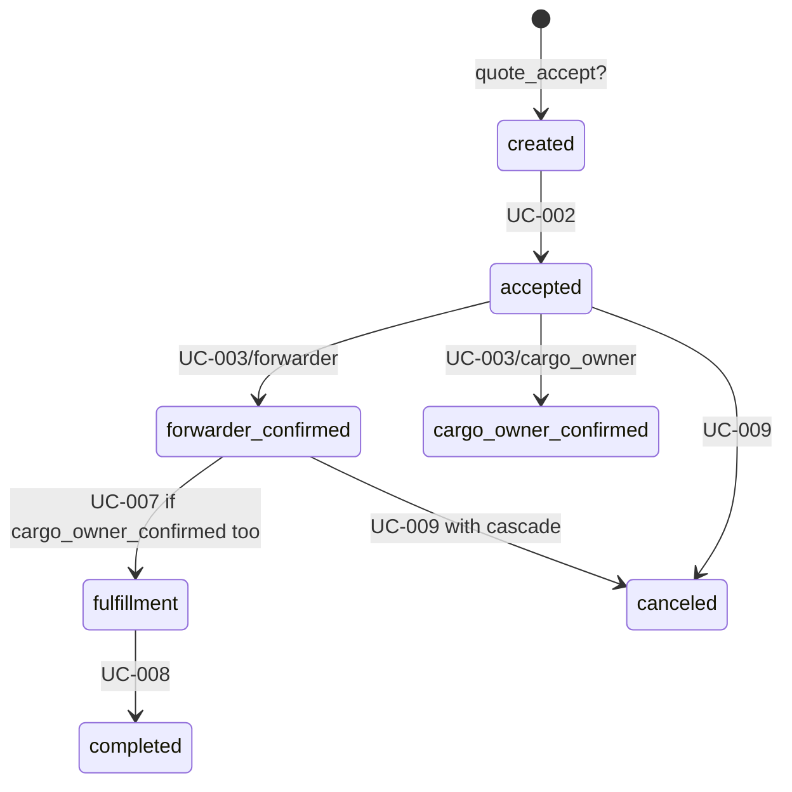

# Artifact kind: `domain-model`

> Canonical model of a domain: aggregates, entities, value objects, relationships, and canonical DDL/pseudo-code/SDL — all as standalone self-contained text.

## Purpose

Domain models are the **rebuild spec** for a bounded context. Given only the domain-model artifact, a reader should be able to recreate the schema, the core operations, the events, and the API contract — without touching the original codebase.

This is the primary consumer of C10 (canonical-reproducer) and the primary artifact fed to a rewrite effort or RAG system.

## When to create

- One per bounded context, after its use-cases/invariants/scenarios are largely verified.
- When the domain's structure stabilizes enough to canonicalize.
- When preparing a RAG export or rewrite.

## Frontmatter schema

```yaml
kind: domain-model
id: DM-{auto}
domain: "orders"
aggregate_roots:
  - name: "Order"
    description: "A contract between cargo_owner, forwarder, and optional operator to move goods."
  - name: "Shoulder"
    description: "A transport leg of an order; orders can have multiple shoulders (multi-modal)."
entities:
  - name: "SalesOrder"
    parent_aggregate: "Order"
  - name: "Point"
    parent_aggregate: "Order"
value_objects:
  - name: "Address"
  - name: "Currency"
external_dependencies:
  - domain: "companies"
    relationship: "references cargo_owner, forwarder, operator"
  - domain: "calculator"
    relationship: "consumes price calculations"
canonical_ddl: |
  -- Full standalone SQL DDL, zero file references
  CREATE TYPE order_status_enum AS ENUM ('created', 'accepted', 'cargo_owner_confirmed', 'forwarder_confirmed', 'fulfillment', 'rejected', 'canceled', 'completed', 'removed');
  CREATE TABLE orders (
    id SERIAL PRIMARY KEY,
    code VARCHAR(50) NOT NULL UNIQUE,
    status order_status_enum NOT NULL DEFAULT 'created',
    cargo_owner_id INT NOT NULL,
    forwarder_id INT NOT NULL,
    operator_id INT,
    quote_id INT NOT NULL,
    -- ... full column list
    created_at TIMESTAMP NOT NULL DEFAULT NOW(),
    updated_at TIMESTAMP NOT NULL DEFAULT NOW()
  );
  CREATE INDEX idx_orders_status ON orders(status);
  CREATE INDEX idx_orders_cargo_owner ON orders(cargo_owner_id);
  -- ... additional DDL including FKs
canonical_pseudo_code:
  actions:
    - name: "confirm"
      ref: "canonical/orders/pseudo-code/confirm.md"
    - name: "cancel"
      ref: "canonical/orders/pseudo-code/cancel.md"
canonical_sdl: |
  # Standalone GraphQL SDL
  enum Orders_StatusEnum {
    created
    accepted
    cargo_owner_confirmed
    forwarder_confirmed
    fulfillment
    rejected
    canceled
    completed
  }
  type Orders_Order {
    id: Int!
    code: String!
    status: Orders_StatusEnum!
    # ...
  }
  # ...
domain_events:
  - name: "OrderCreated"
    payload: "{ id, code, cargo_owner_id, forwarder_id, operator_id }"
    emitted_by: "UC-001"
  - name: "OrderConfirmedByForwarder"
    emitted_by: "UC-003"
  - name: "OrderCanceled"
    emitted_by: "UC-009"
state_machine:
  initial: ["created", "accepted (via quote acceptance)"]
  states: ["created", "accepted", "cargo_owner_confirmed", "forwarder_confirmed", "fulfillment", "canceled", "completed", "rejected", "removed"]
  transitions:
    - from: "created"
      to: "accepted"
      trigger: "UC-002"
      guard: "INV-005"
    - from: "accepted"
      to: "forwarder_confirmed"
      trigger: "UC-003 (forwarder)"
      guard: "INV-003 + INV-005"
    # ...
use_cases_ref: ["UC-001", "UC-002", "UC-003", "UC-009", "UC-015"]
invariants_ref: ["INV-001", "INV-003", "INV-005", "INV-008", "INV-012"]
scenarios_ref: ["SC-042", "SC-043", "SC-051"]
glossary_ref: ["TERM-005", "TERM-012", "TERM-013"]
verification:
  source: "inferred_from_code + domain_owner_partial"
  confidence: "strong-inferred"
  evidence_refs: ["EVID-018", "EVID-024"]
  last_verified: "2026-04-21"
  validation_passes:
    - ddl_compile: true
    - sdl_parse: true
    - reproducibility_simulation: "82%"
bounded_context: "orders"
lifecycle_state: "active" | "draft" | "superseded"
```

## Body structure

1. **Overview** (the domain's purpose in the business).
2. **Aggregate roots and entities** (structural description).
3. **Value objects** (immutable bits of data).
4. **Canonical DDL** (full SQL; no file references).
5. **Canonical pseudo-code** (per action; no file references).
6. **Canonical SDL** (full GraphQL; no file references).
7. **Domain events** (what the domain publishes).
8. **State machines** (for stateful entities).
9. **External dependencies** (other bounded contexts).
10. **Invariants** (business rules enforced).
11. **Key use-cases** (entry points into the domain).
12. **Glossary** (domain-specific terms).
13. **Open questions / parked hypotheses**.

## Example heading tree (TripSales — Orders)

```markdown
# DM-001 — Orders Domain

## Overview
The Orders domain owns the contract lifecycle between shipping participants ...

## Aggregate roots
### Order
The primary aggregate. Owns shoulders, points, cargo (references), sales order.

### Shoulder
Represents a transport leg ...

## Entities (non-root)
- SalesOrder — financial twin of an Order
- Point — origin/destination/waypoint

## Value objects
- Address
- Currency
- CargoDescriptor

## Canonical DDL
<see frontmatter>

## State machine: Order.status
<Mermaid state diagram>


## Canonical pseudo-code
### Action: confirm
<see canonical/orders/pseudo-code/confirm.md>

## Domain events
- OrderCreated
- OrderConfirmedByForwarder
- OrderConfirmedByCargoOwner
- OrderCanceled
- OrderCompleted

## External dependencies
- `companies`: resolves cargo_owner/forwarder/operator IDs
- `calculator`: computes rates used during creation
- `trips`: executes the fulfillment

## Invariants
- INV-001 ...
- INV-003 ...

## Glossary (local)
- Order (TERM-001)
- forwarder_confirmed (TERM-012)
...
```

## Validation rules

- `canonical_ddl` must pass `psql --check` (C11 mode 1).
- `canonical_sdl` must parse (C11 mode 2).
- Every `use_cases_ref`, `invariants_ref`, `scenarios_ref`, `glossary_ref` must exist.
- State machine transitions must all have a trigger + guard.

## Links

- `contains` — (domain-model) contains (aggregate) contains (entity).
- `references` — (domain-model) references (domain-model) cross-domain.
- `realizes` — (use-case) realizes (domain-model) capabilities.
- `enforces` — (domain-model) enforces (invariant).

## Lifecycle

- `draft` — under construction.
- `active` — validated; used as the rebuild spec.
- `superseded` — replaced (e.g. bounded context split).

## Freshness

Re-validate when any of its refs change. Drift triggers C10 to re-render the canonical fields.
