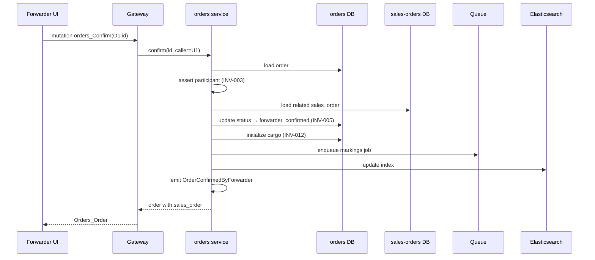

# Artifact kind: `scenario`

> An executable specification of a use case in Gherkin Given/When/Then form, optionally with a Mermaid sequence diagram.

## Purpose

Scenarios are the **concrete, testable form** of use cases. They fill the gap between abstract description (use-case) and runnable test. They serve as:
- Acceptance criteria for rewrites.
- Test specs for generated test code.
- Onboarding stories (reading scenarios builds mental model).
- RAG input (concrete examples retrieved per query).

## When to create

- For every verified use case, at least 3 scenarios (happy + 2 failure).
- When a new invariant needs observable proof.
- When a Domain Owner gives a concrete example during an interview.

## Frontmatter schema

```yaml
kind: scenario
id: SC-{auto}
feature: "Order confirmation by forwarder"
use_case_ref: UC-003
invariants_verified: [INV-003, INV-005, INV-012]
scenario_type: "happy_path" | "failure" | "edge_case" | "exploratory"
gherkin_feature: |
  Feature: ...
  Background: ...
  Scenario: ...
visualizations:
  - type: "mermaid-sequence" | "mermaid-state" | "mermaid-flowchart"
    content: |
      sequenceDiagram
          ...
verification:
  automated: "<path to test suite OR 'pending'>"
  manual: "<manual run notes OR null>"
  source: "inferred_from_code" | "domain_owner"
  confidence: "verified" | "strong-inferred" | "inferred" | "speculation"
  evidence_refs: ["EVID-027"]
  last_verified: "2026-04-21"
bounded_context: "orders"
lifecycle_state: "active" | "needs_update" | "deprecated"
```

## Body structure

1. **Feature overview** (2-3 sentences — business value).
2. **Actor roles** (who does what in this scenario).
3. **Background** (common Given steps).
4. **Happy path scenario**.
5. **Failure scenarios** (at least 2: authorization + precondition).
6. **Visualizations** (Mermaid sequence / state machine).
7. **Verification** (how we know this scenario is correct — test, manual, interview).
8. **Traceability** (use-case, invariants, glossary terms).

## Example (TripSales)

```markdown
---
kind: scenario
id: SC-042
feature: "Order confirmation by forwarder"
use_case_ref: UC-003
invariants_verified: [INV-003, INV-005, INV-012]
scenario_type: "happy_path"
---

# SC-042 — Forwarder confirms an accepted order

## Feature overview
Validates that a forwarder employee can confirm an accepted order, triggering forwarder_confirmed status, cargo initialization, and markings generation.

## Gherkin feature

```gherkin
Feature: Order confirmation by forwarder
  As a forwarder employee
  I want to confirm an order has been committed
  So that cargo initialization proceeds and the order can reach fulfillment

  Background:
    Given an order O1 with status 'accepted'
    And O1.forwarder_id = company C_forwarder.id
    And O1.cargo_owner_id = company C_cargo_owner.id
    And user U1 is an employee of C_forwarder

  Scenario: Happy path — forwarder confirms
    When U1 calls orders_Confirm(O1.id)
    Then O1.status becomes 'forwarder_confirmed'
    And cargo is initialized with available_at derived from O1.form.pickup_date
    And a cargo markings job is enqueued (attempts=50, backoff=10s)
    And the Elasticsearch index is updated
    And event OrderConfirmedByForwarder is emitted
    And the result includes sales_order attached

  Scenario: Non-participant is rejected
    Given user U2 is an employee of company C_other (not in O1's participants)
    When U2 calls orders_Confirm(O1.id)
    Then an error '__NOT_FOUND__' is raised
    And O1.status remains 'accepted'
    And no cargo is initialized
    And no markings job is enqueued

  Scenario: Cargo_owner mirror path
    Given user U3 is an employee of C_cargo_owner
    When U3 calls orders_Confirm(O1.id)
    Then O1.status becomes 'cargo_owner_confirmed'
    And no cargo markings job is enqueued
    And Elasticsearch index is updated
    And event OrderConfirmedByCargoOwner is emitted
```

## Mermaid sequence



## Verification
- **Automated**: pending (test spec to be generated from this scenario).
- **Manual**: last run 2026-04-21; SC-042 passes via UI manual walkthrough.
- **Confidence**: inferred. Needs Domain Owner confirmation on the dual-confirm pattern semantics.

## Traceability
- Use case: UC-003.
- Invariants: INV-003, INV-005, INV-012.
- Terms: forwarder_confirmed (TERM-012), cargo_owner_confirmed (TERM-013), forwarder (TERM-005).
- Related scenarios: SC-043 (cancel), SC-051 (reject).
```

## Validation rules

- `gherkin_feature` must parse with `@cucumber/gherkin`.
- `invariants_verified` must be non-empty.
- `use_case_ref` must exist.
- `scenario_type` must match list.
- Mermaid (if present) must render without syntax errors.

## Links

- `verifies` — (scenario) verifies (use-case).
- `verifies` — (scenario) verifies (invariant).
- `based_on` — (scenario) based_on (glossary).
- `supersedes` — (scenario) supersedes (scenario) older version.

## Lifecycle

- `draft` — being written.
- `active` — verified; used as test spec.
- `needs_update` — upstream use-case or invariant changed.
- `deprecated` — no longer relevant.

## Freshness

On use-case change → scenarios auto-flag `needs_update`. On invariant change → scenarios verifying it flag too.
