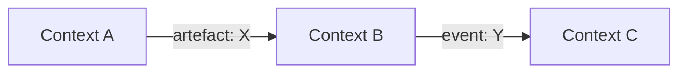

# /fpf-decompose — Structured Problem Decomposition

You are performing a structured decomposition of a complex problem or system using the
First Principles Framework (FPF). Follow these steps precisely.

## Step 1 — Capture the problem

Ask the user for a description of the problem, system, or domain they want to decompose.
If the user already provided one in their message, use that directly.
Restate the problem in one sentence to confirm understanding.

## Step 2 — Identify Bounded Contexts (A.1.1)

Read `sections/04-part-a-kernel-architecture-cluster/03-a-1-1---u-boundedcontext-the-semantic-frame.md`
for the formal definition, then apply:

1. List the distinct semantic domains present in the problem.
2. For each domain, define a **Bounded Context** — a region where terms have exactly one meaning.
3. Name each context using a short, descriptive noun-phrase (e.g., "Payment Processing",
   "User Identity", "Inventory Management").
4. State what is INSIDE each context and what is explicitly OUTSIDE.

## Step 3 — Assign Roles (A.2)

For each Bounded Context, identify:

- **Key Roles** — who or what acts within this context (human, system, or AI agent).
  Read `sections/04-part-a-kernel-architecture-cluster/04-a-2---role-taxonomy.md` for the Role Taxonomy.
- **Responsibilities** — what each role is accountable for producing or maintaining.
- **Capabilities** — what each role needs in order to fulfil its responsibilities.

## Step 4 — Define Interfaces

For every pair of contexts that must communicate:

- Name the interface (e.g., "Order → Payment handoff").
- Specify the direction of data/control flow.
- State what crosses the boundary: artefacts, events, or queries.
- Flag any vocabulary that means different things in each context (semantic drift).

## Step 5 — Check for Category Errors (A.7 Strict Distinction)

Review the decomposition for common confusions:

- Role confused with function (who vs. what)
- Method confused with work product (how vs. what-was-produced)
- Capability confused with responsibility (can-do vs. must-do)
- Two contexts merged that use the same word with different meanings

If you find errors, fix them and note the correction.

## Step 6 — Produce the Decomposition Table

Output a markdown table:

| Context | Responsibility | Key Roles | Interfaces |
|---------|---------------|-----------|------------|
| ... | ... | ... | ... |

Below the table, list any **open questions** — things that could not be resolved
without more information from the user.

## Step 7 — Generate a Mermaid Diagram (optional)

If the decomposition has 3+ contexts, produce a mermaid graph showing contexts as nodes
and interfaces as labeled edges:

## Step 8 — Suggest Forgeplan Artefacts (if available)

If the forgeplan plugin is available in this session:

- Suggest creating a **PRD** (Product Requirements Document) for the overall system.
- For each Bounded Context, suggest creating an **RFC** that details the design.
- For cross-cutting decisions, suggest an **ADR** (Architecture Decision Record).
- Remind the user: `PRD = what, RFC = how, ADR = why`.

## Tone

Use plain language. Introduce FPF terms (U.BoundedContext, U.RoleAssignment, Strict Distinction)
only in parentheses after the plain-language equivalent, so the user learns the vocabulary
without being blocked by it.
