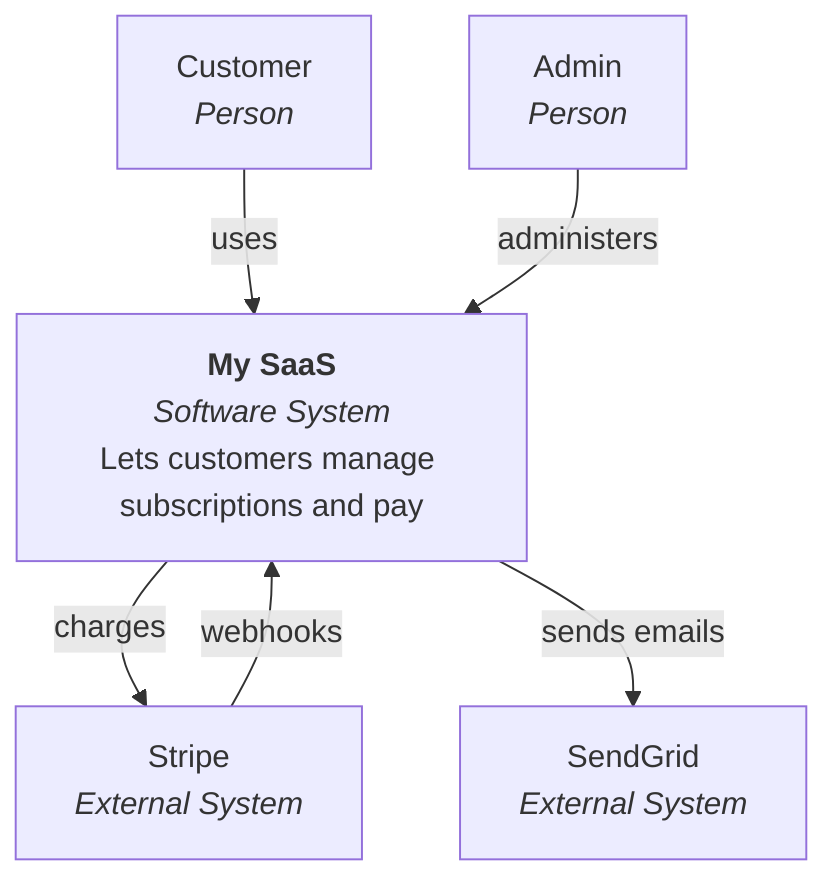
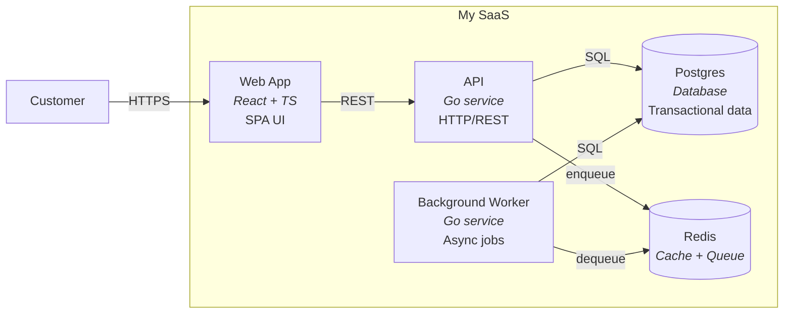

# c4-diagram — C4 architecture diagrams via guided interview

Walk through Simon Brown's C4 model — **Context → Container → Component → Code** — by asking the user the right questions at each level and producing Mermaid diagrams plus a written context document. Each diagram is one zoom level of the system, and you stop at the level that adds value (most teams stop at Component; Code level is rarely worth the effort).

This skill **draws the system with you** through structured questions. For one-shot architectural review (no drawing) — use `architect-reviewer` agent in `agents-pro`. For brownfield ingestion of existing C4 docs — use [`c4-to-forge.yaml`](../../../forgeplan-brownfield-pack/mappings/c4-to-forge.yaml) mapping.

---

## Dispatch mode — invoked from adr-architect Step 5b.1 (Sprint Z9 — PRD-060)

When dispatched non-interactively from `adr-architect` (full ADR, ≥3 modules), follow this procedure instead of the interactive interview:

1. **Receive** the structured prompt with: system name, module list, target level depth, output path.
2. **Skip the interactive interview** — derive all answers from the context the orchestrator provided. Do not ask the user questions; infer container names and relationships from the module list and any parent PRD body accessible in context.
3. **Generate L1 (Context) + L2 (Container) Mermaid diagrams** as a single combined file. L3 only if explicitly requested in the dispatch prompt.
4. **Write** to the path specified by the orchestrator (typically `docs/c4/<ADR-NNN>.md` next to the ADR being drafted).

   **4b. Pre-write idempotency check (Sprint AA / PRD-068 / G3):**

   Before writing to `docs/c4/<ADR-ID>.md`, check whether the target file already exists. Dispatch mode MUST NOT silently overwrite a prior diagram — re-runs of `adr-architect` Step 5b.1 on the same ADR ID would otherwise destroy human review work or earlier diagram iterations.

   ```bash
   if [ -f "docs/c4/<ADR-ID>.md" ]; then
     # Existing file detected — do NOT proceed with the canonical path.
     # Choose one of two resolution paths below.
   fi
   ```

   **Path A — Interactive resolution (DEFAULT)**:

   Emit a `<<NEED_USER_INPUT>>` sentinel with exactly three options. Return to the orchestrator without writing; the orchestrator surfaces the prompt to the user:

   ```
   <<NEED_USER_INPUT>>
   The file `docs/c4/<ADR-ID>.md` already exists.
   Choose how to proceed:
     1. overwrite — replace existing file (loses prior diagram + any human edits)
     2. v2 — write to `docs/c4/<ADR-ID>.v2.md` (preserves prior; next re-run picks .v3, .v4, …)
     3. abort — return without writing; orchestrator decides next step
   <<END_NEED_USER_INPUT>>
   ```

   **Path B — Auto-versioning (orchestrator opt-in)**:

   When the orchestrator invokes Dispatch mode with `auto_versioning=true` in the dispatch prompt, NEVER overwrite and NEVER prompt. Auto-append the next available numeric suffix:

   ```bash
   # Pseudocode — find next free slot
   target="docs/c4/<ADR-ID>.md"
   if [ -f "$target" ]; then
     n=2
     while [ -f "docs/c4/<ADR-ID>.v${n}.md" ]; do n=$((n+1)); done
     target="docs/c4/<ADR-ID>.v${n}.md"
   fi
   # Write to $target
   ```

   **Path selection rule**: default is Path A (interactive). Path B is opt-in via the dispatch prompt — the orchestrator (`adr-architect`, `/forge-cycle`, or future automation) declares `auto_versioning=true` when human prompting is not desired (e.g., batch ADR regeneration, scripted pipelines).

   If the file does not exist, proceed normally with the canonical path `docs/c4/<ADR-ID>.md` — no prompt, no suffix.

5. **Return** to the orchestrator: path to the generated diagrams file + a 2-sentence text summary describing the system context (this summary is used by `adr-architect` to seed the ADR body's `## Context` section).

**Use Dispatch mode when:**
- `adr-architect` detects a ≥3-module decision and wants to ground the ADR body in explicit boundaries before prose is written (Sprint Z9 PRD-060 Step 5b.1).
- `/forge-cycle` Phase 4 (Shape) wants visual context for a Deep+ feature before the RFC is authored.

**Use interactive mode when:**
- User explicitly invokes `/c4-diagram` — they want to walk through the questions.
- System is new or poorly understood — the interactive interview surfaces what's actually deployed that the orchestrator can't know from PRD context alone.

### Dispatch mode — Hard rules

- **Idempotency contract**: Dispatch mode MUST NOT silently overwrite an existing `docs/c4/<ID>.md`. Re-runs either prompt via `<<NEED_USER_INPUT>>` or auto-version with `.v2`/`.v3` suffix.
- **No interactive prompting in auto-versioning mode**: when the orchestrator declares `auto_versioning=true`, never emit `<<NEED_USER_INPUT>>` — auto-append the next available numeric suffix and proceed.
- **No interview**: do not ask the user questions in Dispatch mode under any circumstance other than the idempotency sentinel in Step 4b (interactive resolution path).
- **Return path always concrete**: Step 5 must report the actual file path written, which may be `docs/c4/<ID>.md`, `docs/c4/<ID>.v2.md`, or higher, depending on resolution path taken.

### Dispatch mode — Output location convention

Canonical first-write path: `docs/c4/<ADR-ID>.md` (e.g., `docs/c4/ADR-007.md`).

When the canonical file already exists, Dispatch mode versions the output:

| Suffix | When written |
|---|---|
| `<ADR-ID>.md` | First Dispatch invocation for this ADR (file did not exist) |
| `<ADR-ID>.v2.md` | Second invocation under Path A "v2" choice OR first re-run under Path B auto-versioning |
| `<ADR-ID>.v3.md`, `.v4.md`, ... | Subsequent re-runs, picking the next free numeric slot |

Versioned files (`.v2`, `.v3`, ...) are **peers** of the canonical file, not replacements. Downstream consumers (ADR body links, brownfield ingest via `c4-to-forge.yaml`, future review tooling) should link to the canonical `<ADR-ID>.md` unless a specific historical version is needed.

If a user explicitly chooses `overwrite` in Path A, only the canonical `<ADR-ID>.md` is touched; pre-existing `.v2`, `.v3` files are NOT auto-cleaned (preserve historical evolution).

Reference: Sprint Z9 PRD-060 (Dispatch mode foundation), Sprint AA PRD-068 (G3 closure — idempotency protection). Methodology: Simon Brown's C4 model (c4model.com). Pairs with EPIC-001 4-layer pipeline — C4 is orthogonal architecture documentation, not part of S10-S13 pipeline layers.

---

## When to use

- Onboarding a new system — need diagrams for documentation.
- Designing a new system and want C4-style framing rather than ad-hoc diagrams.
- Existing system with no diagrams, planning a refactor — capture the current state first.
- User explicitly invokes `/c4-diagram` or asks "draw a C4 diagram", "architecture diagram", "архитектурная диаграмма".

## When NOT to use

- One-off architectural decision needing a diagram — embed Mermaid directly in the ADR via `forgeplan new adr`. C4 is overkill.
- Domain modelling without deployment focus — use [`/ddd-decompose`](../ddd-decompose/SKILL.md) instead. C4 talks about runtime units; DDD talks about domain meanings. Pair them.
- The system is too small for 4 levels — single service + frontend = Container level is enough; skip Component and Code.
- Existing C4 docs you want to ingest — use the [`c4-to-forge.yaml`](../../../forgeplan-brownfield-pack/mappings/c4-to-forge.yaml) mapping in `forgeplan-brownfield-pack`.

---

## C4 in 30 seconds

| Level | What it shows | Audience | Example |
|---|---|---|---|
| **L1 — Context** | The system as a single box with users + external systems around it | Anyone (CEO, PM, dev) | "Our SaaS, used by Customers, integrates with Stripe and SendGrid" |
| **L2 — Container** | Deployment / runtime units inside the system | Developers, ops | "Web app (React), API (Go), Postgres, Redis, worker queue" |
| **L3 — Component** | Components inside one container | Developers of that container | "API has Auth handler, Order handler, Catalog handler, ..." |
| **L4 — Code** | Class/function structure inside one component | Developers diving into one component | UML / package diagrams (rarely drawn — the IDE shows this) |

**Rule of thumb**: ship Context + Container always. Ship Component when a container has 5+ logical pieces. Ship Code only when explaining a tricky algorithm.

---

## Process

### 1. Orient

```bash
pwd
test -d .forgeplan && echo "forgeplan workspace" || echo "no forgeplan"
command -v forgeplan
test -d docs/architecture && echo "docs/architecture exists" || mkdir -p docs/architecture/c4
test -f CLAUDE.md && echo "claude md present"
```

Outputs go to `docs/architecture/c4/` with one file per level (`c1-context.md`, `c2-containers.md`, `c3-components-<container>.md`). If forgeplan is available, an Epic + per-level PRDs/Notes also get created.

### 2. Establish the system identity

Open with one question:

> "What's the name of the system you want to diagram, and in one sentence — what does it do?"

Use the answer to name files (`my-system-c1-context.md` etc.) and to populate the central box of the L1 diagram.

### 3. Build L1 — Context diagram

Ask, in order:

```
1. Who are the human user types? List them by role (Customer, Admin, Support agent, Auditor).
2. What other systems does your system talk to? (Stripe, SendGrid, Salesforce, internal services)
3. What's the direction of each interaction? (your system calls them, they call you, both)
4. What's the protocol? (REST, GraphQL, webhook, queue, file drop)
```

Render:



Save as `docs/architecture/c4/c1-context.md` with the diagram + a 5-10 line written context describing each box and arrow.

### 4. Build L2 — Container diagram

Ask:

```
1. What runtime units are inside the system? (frontend, backend services, databases, queues, workers)
2. For each — what tech / language / framework?
3. How do they talk to each other? (HTTP, gRPC, queue, shared DB)
4. What are the operational characteristics? (always-on, batch, scheduled)
```

Render:



Save as `docs/architecture/c4/c2-containers.md` with a written description of each container's responsibility.

### 5. Build L3 — Component diagram (per container, optional)

Ask the user which container they want to zoom into. Then:

```
1. What logical components live inside <container>?
2. What does each component own (data, behaviour, integration)?
3. How do they collaborate? (function call, internal queue, shared state)
4. Which components talk to other containers / external systems?
```

Render the L3 for that container only. Save as `docs/architecture/c4/c3-components-<container>.md`.

Repeat for any container the user wants to detail. Most teams stop at the API container; sometimes the Worker too.

### 6. L4 — Code (skip by default)

Ask: "Is there a specific component where the internal class/function structure is tricky enough to draw?"

If yes — produce a UML-style class/function diagram. If no (the typical answer) — note in the Component diagram doc that L4 isn't drawn and the IDE serves as the source of truth.

### 7. Forgeplan integration

Write the diagrams as forgeplan artifacts using the [`c4-to-forge.yaml`](../../../forgeplan-brownfield-pack/mappings/c4-to-forge.yaml) mapping. Detect `mcp__forgeplan__forgeplan_new` availability first; prefer MCP, CLI fallback only when MCP unavailable.

| C4 level | Forgeplan artifact |
|---|---|
| L1 — Context | Epic (groups everything) + Note (the L1 doc) |
| L2 — Container | PRD per container, all linked to the Epic |
| L3 — Component | RFC per detailed container |
| L4 — Code | (rare) RFC or Spec |

**MCP path (preferred)**:
```
mcp__forgeplan__forgeplan_new(kind="epic", title="<system> architecture (C4)")
mcp__forgeplan__forgeplan_new(kind="note", title="<system> — L1 Context diagram + system landscape")
mcp__forgeplan__forgeplan_link(source="NOTE-NNN", target="EPIC-MMM", relation="based_on")

# Per container (L2)
for c in <list of containers>:
  mcp__forgeplan__forgeplan_new(kind="prd", title="<system> — <container> container")
  mcp__forgeplan__forgeplan_link(source="PRD-NNN", target="EPIC-MMM", relation="based_on")

# Per detailed container (L3)
for c in <list of detailed>:
  mcp__forgeplan__forgeplan_new(kind="rfc", title="<system> — <container> components")
  mcp__forgeplan__forgeplan_link(source="RFC-NNN", target="PRD-CONTAINER", relation="based_on")
```

**CLI fallback (only when MCP unavailable)**:
```bash
forgeplan new epic "<system> architecture (C4)"
forgeplan new note "<system> — L1 Context diagram + system landscape"
forgeplan link NOTE-NNN EPIC-MMM --relation based_on

for c in <list of containers>; do
  forgeplan new prd "<system> — <container> container"
  forgeplan link PRD-NNN EPIC-MMM --relation based_on
done

for c in <list of detailed>; do
  forgeplan new rfc "<system> — <container> components"
  forgeplan link RFC-NNN PRD-CONTAINER --relation based_on
done
```

If neither MCP nor CLI available — leave the markdown files in `docs/architecture/c4/` as the source.

### 8. Hand-off

```
✓ L1 Context     docs/architecture/c4/c1-context.md      (or NOTE-NNN if forgeplan)
✓ L2 Container   docs/architecture/c4/c2-containers.md   (or PRD-NNN per container)
✓ L3 Component   docs/architecture/c4/c3-components-<X>.md (only for containers you detailed)
- L4 Code        skipped (typical)

Next steps:
  • /ddd-decompose to add the domain context map (DDD complements C4)
  • /refine each PRD to lock terminology and surface contradictions
  • /forge-cycle "<implement <container>>" to build one container end-to-end
```

---

## Forgeplan integration (MCP-first per PRD-022)

The output diagrams + docs map to forgeplan via [`c4-to-forge.yaml`](../../../forgeplan-brownfield-pack/mappings/c4-to-forge.yaml). Step 7 above wires this automatically — prefers MCP tools when available, CLI fallback otherwise.

For Deep+ scope (irreversible architecture decisions surfaced during the interview):

**MCP path**:
```
mcp__forgeplan__forgeplan_new(kind="adr", title="<system> — <key architecture decision>")
# Or dispatch adr-architect agent for MADR 3.0 format
mcp__forgeplan__forgeplan_link(source="ADR-NNN", target="EPIC-<system>", relation="informs")
mcp__forgeplan__forgeplan_reason(id="ADR-NNN")     # ADI 3+ hypotheses
```

**CLI fallback**:
```bash
forgeplan new adr "<system> — <key architecture decision>"
forgeplan link ADR-NNN EPIC-<system> --relation informs
forgeplan reason ADR-NNN
```

### Want this orchestrated for you?

`/forge-cycle "design <system> architecture"` (in [`forgeplan-workflow`](../../../forgeplan-workflow/README.md)) can run the full lifecycle. The C4 diagrams produced by this skill become the Shape-phase content; Build phase implements one container at a time.

---

## Companion skills

- [`/ddd-decompose`](../ddd-decompose/SKILL.md) — domain-side decomposition. Run before `/c4-diagram` if domain meanings drive the container split. Run after if container split was driven by deployment/operational concerns.
- [`/refine`](../refine/SKILL.md) — refine an existing C4 doc, surface contradictions.
- `architect-reviewer` agent (in `agents-pro`) — advisory review of an existing C4 set without drawing.
- [`c4-to-forge.yaml`](../../../forgeplan-brownfield-pack/mappings/c4-to-forge.yaml) — ingestion mapping for existing C4 docs (brownfield).

---

## Anti-patterns

- ❌ **Drawing all 4 levels for a small system.** Code level is rarely worth it; Component only when a container has 5+ pieces.
- ❌ **Mixing levels in one diagram.** L1 should NOT show containers. L2 should NOT show external systems' internals.
- ❌ **Using boxes inside boxes for hierarchy on L2.** That's L3 territory. Stay flat per level.
- ❌ **Asking the user "what's a Container in C4?".** Explain by example: "Frontend SPA, API, database — those are containers."
- ❌ **Naming conventions inconsistent across diagrams.** `Auth Service` in L1 should be `Auth Service` in L2 too, not `auth-svc`.
- ❌ **Skipping the description text.** A Mermaid diagram alone isn't enough; the 5-10 lines describing each box and arrow add the meaning the diagram can't carry.

---

## Mermaid notation conventions

- Person: `["Name<br/><i>Person</i>"]`
- Software system: `["Name<br/><i>Software System</i><br/>One-line description"]`
- External system: `["Name<br/><i>External System</i>"]`
- Container: `["Name<br/><i>Tech / framework</i><br/>One-line responsibility"]`
- Database: `[("Name<br/><i>Database</i>")]`
- Queue/Cache: `[("Name<br/><i>Queue / Cache</i>")]`

Arrows labelled with **action + protocol**: `-->|sends emails via SMTP|`, `-->|HTTPS REST|`, `-->|enqueue job|`.

---

## Companion mapping

If you have **existing C4 documentation** (Markdown, Structurizr DSL output) and want to ingest into forgeplan rather than redraw — use [`c4-to-forge.yaml`](../../../forgeplan-brownfield-pack/mappings/c4-to-forge.yaml) from `forgeplan-brownfield-pack`. That's the bottom-up path; `/c4-diagram` is the top-down (interview) path. Different starting points, same artifact graph at the end.
