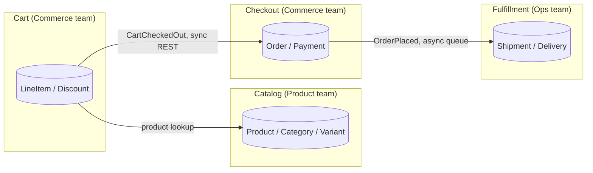

# ddd-decompose — Domain-Driven Design via guided interview

Walk a developer through DDD decomposition: bounded contexts → ubiquitous language per context → aggregates → domain events → context map. Outputs Markdown + Mermaid. If `forgeplan` CLI is available, also writes Epic + per-context PRDs + Spec to wire the decomposition into the artifact graph.

This skill is the **interactive companion** to the `ddd-domain-expert` agent in `agents-pro`. The agent gives advisory analysis on existing code; this skill **builds the model with you** through structured questions.

---

## When to use

- Designing a new system with multiple teams or services involved.
- Refactoring a monolith and need to decide where the seams should be.
- Onboarding a brownfield codebase and want a DDD-style mental map.
- User explicitly invokes `/ddd-decompose` or asks "decompose this with DDD", "разложи по DDD", "ограниченные контексты".

## When NOT to use

- General system decomposition without DDD framing — use [`/fpf-decompose`](../../../fpf/skills/fpf-knowledge/SKILL.md) (broader, less ceremony).
- A single-team CRUD app — DDD ceremony is overkill; just write a PRD.
- Brownfield code where DDD is the goal — pair with [`forgeplan-brownfield-pack`](../../../forgeplan-brownfield-pack/skills/ubiquitous-language/SKILL.md) extraction skills which work bottom-up from code.
- Pure architecture diagrams without domain modelling — use [`/c4-diagram`](../c4-diagram/SKILL.md).

---

## Process

### 1. Orient

```bash
pwd
test -d .forgeplan && echo "forgeplan workspace" || echo "no forgeplan"
command -v forgeplan
test -f CLAUDE.md && echo "claude md present"
test -d docs/architecture && echo "docs/architecture exists" || echo "no docs/architecture"
```

If `forgeplan` is available — outputs go into the artifact graph. Otherwise — Markdown files under `docs/architecture/ddd/`.

### 2. Establish the system context

Open with one question:

> "What's the system we're decomposing? In one sentence — what does it do, and who uses it?"

Reflect the answer back, then derive **system actors** (humans and other systems that interact with it). This becomes the outer boundary of the context map.

### 3. Identify bounded contexts

Ask, one context at a time:

```
1. What's a major area of behaviour or business capability inside the system?
2. What language do people use to talk about it? (specific terms, not abstractions)
3. Who owns it? (team, person, "shared" if no clear owner)
4. What does it explicitly NOT handle? (boundary by negation)
5. What does it depend on, what depends on it?
```

Stop adding contexts when the user can't think of new ones or when the existing list covers the system. Typical: 3-7 contexts. Fewer = monolith with no real seams. More = over-decomposition or true platform-scale.

For each context, capture:

| Field | Example |
|---|---|
| Name | `Catalog`, `Cart`, `Checkout`, `Fulfillment`, `Identity` |
| Responsibility | `Product data, search, categories` |
| Owners | `Product team` |
| Outbound | `→ Cart (product lookup), → Search Engine` |
| Inbound | `← Fulfillment (stock updates)` |
| NOT in scope | `Pricing decisions (those live in Cart)` |

### 4. Build the ubiquitous language per context

For each context, ask:

> "List the 3-5 terms you'd use to describe what happens in <context>. Define them in your own words. Are any of them used differently in another context?"

The last question is the **synonym/translator** signal. If `Order` means one thing in Cart and another in Fulfillment — that's a translator boundary. Capture both definitions, mark as a translation.

Output per context:

```markdown
## Context: Catalog

**Ubiquitous language**:
- **Product** — a SKU offered for sale. Has price, description, category. _Note: distinct from `LineItem` in Cart, which adds quantity and discount._
- **Category** — taxonomic grouping for browsing.
- **Variant** — color/size/etc. of the same Product.

**Cross-context translations**:
| Term | Outside meaning | Inside meaning |
|---|---|---|
| Order | (Cart context) | reservation slip |
```

### 5. Find the aggregates inside each context

Ask:

> "Inside <context>, what's the **smallest thing** you need to keep consistent in a single transaction? Name it as a noun."

Aggregates are the consistency boundary. Examples: `Order` (with its line items), `Account` (with balance + transactions), `Subscription` (with plan + billing cycle).

For each aggregate:

| Field | Example |
|---|---|
| Aggregate root | `Order` |
| Internal entities | `LineItem`, `ShippingAddress`, `Discount` |
| Invariants | "total = sum(line_items.price * qty) - discount", "status transitions: created → paid → shipped → delivered" |
| Events emitted | `OrderCreated`, `OrderPaid`, `OrderShipped` |

### 6. Map domain events between contexts

Ask:

> "When <event in context A> happens, what should other contexts know? What's the cleanest way for them to find out — direct call, queue, eventual consistency?"

This builds the **integration map**:

```
Cart  ─── CartCheckedOut ──→ Checkout  (sync, REST)
Checkout ── OrderPlaced ──→ Fulfillment, Notifications  (async, queue)
Fulfillment ── ShipmentDispatched ──→ Notifications  (async, queue)
```

### 7. Render the context map

Generate a Mermaid C4-Container-style diagram:



Save to `docs/architecture/ddd/context-map.md` (or include in the forgeplan artifact below).

### 8. Forgeplan integration (if CLI available)

If `forgeplan` is on `$PATH`:

```bash
# Top-level Epic groups all contexts
forgeplan new epic "<system name> domain decomposition"
# One PRD per bounded context
for ctx in <list of contexts>; do
  forgeplan new prd "<system> — <ctx> bounded context"
  # Body: filled from interview answers in step 3-5
  forgeplan link PRD-<ctx> EPIC-<system> --relation based_on
done
# Specs for cross-context contracts
forgeplan new spec "<system> — domain events catalogue"
forgeplan link SPEC-<events> EPIC-<system> --relation implements
```

If `forgeplan` is missing — just write the Markdown files under `docs/architecture/ddd/`.

### 9. Hand-off

Show the user where artefacts went and what's next:

```
✓ Context map     docs/architecture/ddd/context-map.md (or EPIC-NNN if forgeplan)
✓ Per-context     docs/architecture/ddd/<context>.md   (or PRD-NNN per context)
✓ Domain events   docs/architecture/ddd/events.md      (or SPEC-NNN)

Next steps:
  • /refine each PRD to surface contradictions and lock terminology
  • /c4-diagram to add Container/Component diagrams complementing the DDD map
  • /forge-cycle "<implement first context>" to start building one context end-to-end
```

---

## Forgeplan integration

If the `forgeplan` CLI is on `$PATH`, the decomposition produces Epic + PRDs + Spec naturally (step 8). For Deep+ depth (cross-team, multi-context system):

```bash
forgeplan reason EPIC-NNN          # ADI 3+ hypotheses on the boundary choices
forgeplan validate EPIC-NNN        # confirm MUST sections present
```

DDR-style ADR for the **why** behind specific boundary decisions:

```bash
forgeplan new adr "<system> — bounded context boundaries: <key decision>"
# Body: Context (why this came up), Decision, Alternatives Considered, Consequences, Invariants
forgeplan link ADR-NNN EPIC-NNN --relation informs
```

### Want this orchestrated for you?

`/forge-cycle "decompose <system>"` (in [`forgeplan-workflow`](../../../forgeplan-workflow/README.md)) can run the full lifecycle around a DDD decomposition — `/ddd-decompose` becomes the Shape phase content for an Epic.

---

## Companion skills

- [`/c4-diagram`](../c4-diagram/SKILL.md) — Context/Container/Component diagrams as a complement to the DDD map. Use after DDD decomposition to add deployment-level structure.
- [`/fpf-decompose`](../../../fpf/skills/fpf-knowledge/SKILL.md) — general FPF decomposition without DDD-specific framing. Use when DDD vocabulary doesn't fit (e.g. internal tooling, single-team app).
- [`/refine`](../refine/SKILL.md) — interview-style refinement of an existing decomposition. Use after `/ddd-decompose` to lock terminology.
- Brownfield extraction skills ([`ubiquitous-language`](../../../forgeplan-brownfield-pack/skills/ubiquitous-language/SKILL.md), `intent-inferrer`, `causal-linker`) — bottom-up from existing code instead of top-down interview.

`ddd-domain-expert` agent (in `agents-pro`) — for advisory review of an existing DDD decomposition, or for domain-modelling questions where you want a senior advisor's input.

---

## Anti-patterns

- ❌ **Decomposing into 10+ contexts on first pass.** Over-decomposition is harder to walk back than under-decomposition. Start with 3-5; add more only when the existing ones genuinely don't cover something.
- ❌ **One context per database table.** Tables ≠ aggregates ≠ contexts. A context can have many tables; a table can serve many contexts.
- ❌ **Skipping the ubiquitous language step.** Without language, the boundaries drift. The whole point of DDD is the shared vocabulary.
- ❌ **Asking "what's a bounded context?" theoretically.** Stay concrete: ask about the system the user is decomposing, not the methodology.
- ❌ **Drawing the context map before identifying the contexts.** Diagram last, after step 6 (events). Otherwise you'll redraw it three times.
- ❌ **Ignoring synonyms.** `Order` in Cart vs Checkout is a translator, not a sloppy naming. Capture it.

---

## Examples

See [`forgeplan-brownfield-pack/examples/`](../../../forgeplan-brownfield-pack/examples/) for sample DDD decompositions extracted from the TripSales project (`tripsales-glossary-sample.md`, `tripsales-use-case-sample.md`). Those came bottom-up via brownfield extraction; `/ddd-decompose` produces the same artifact shapes top-down via interview.
